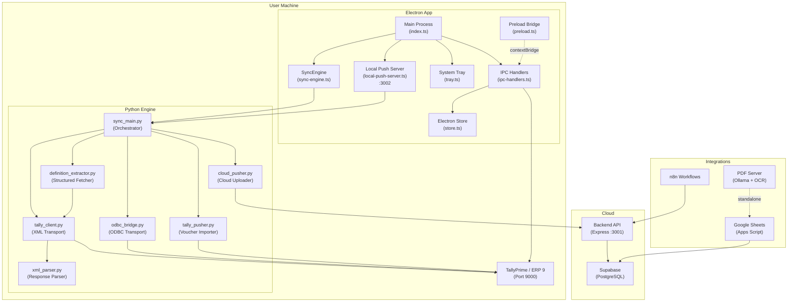
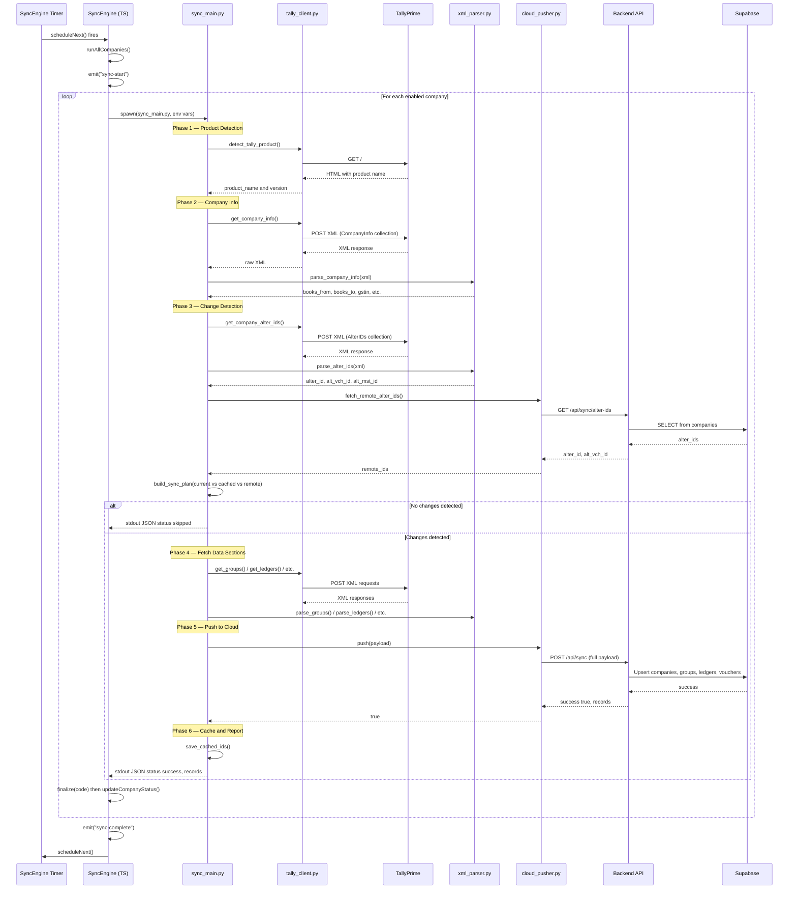
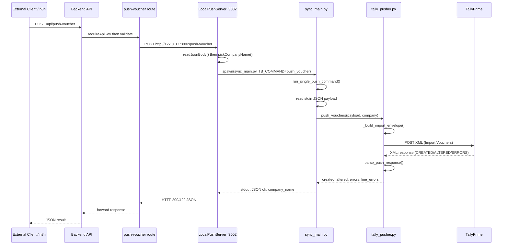
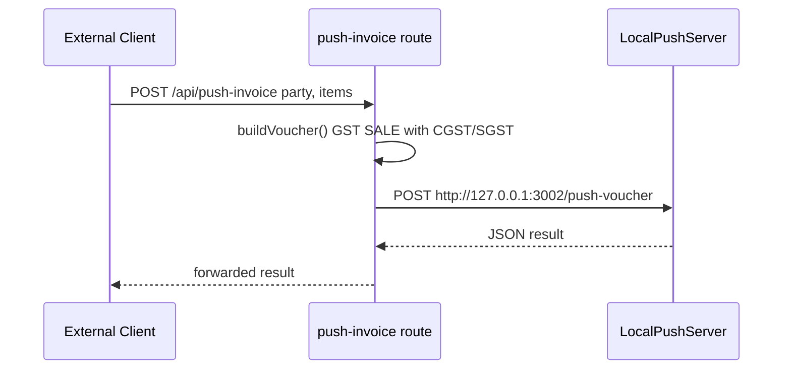
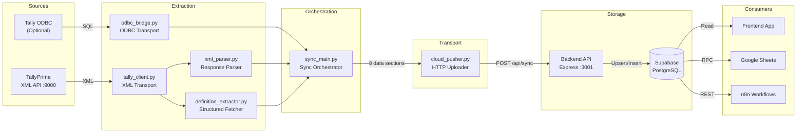
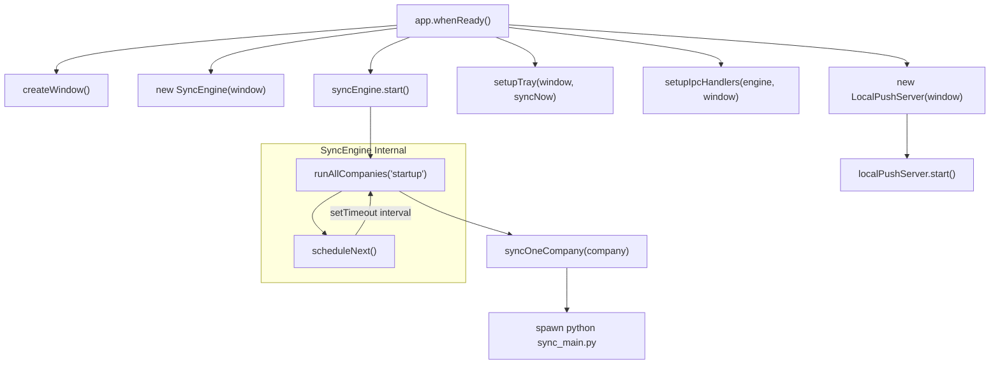
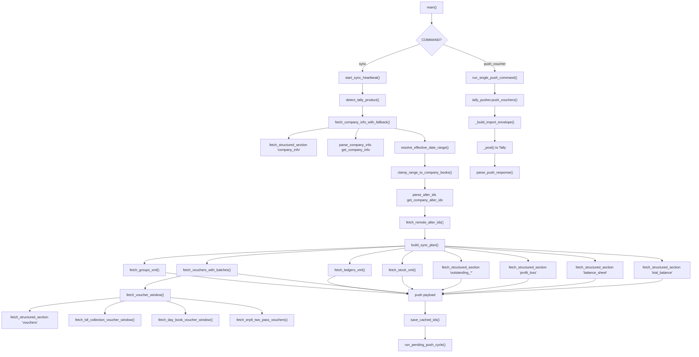
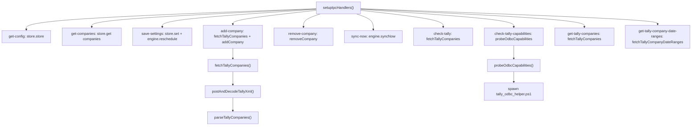
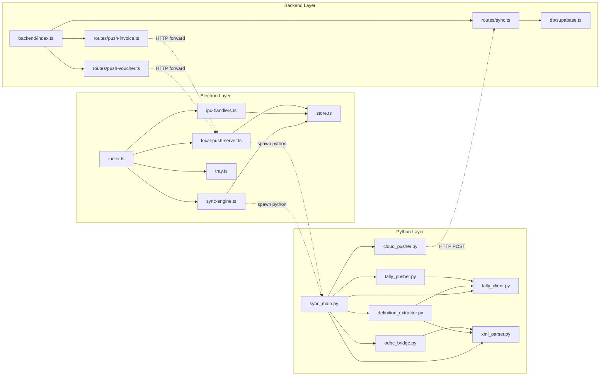
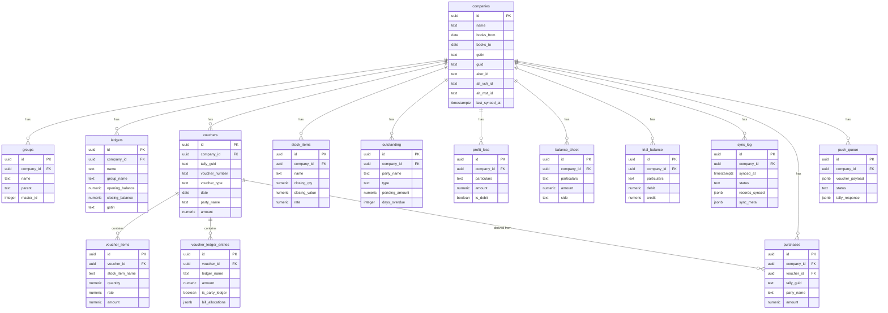

# TallyBridge — Complete Codebase Architecture & Documentation

> **Scope**: Everything **except** the `frontend/` directory.  
> **Generated**: 2026-04-24

---

## Table of Contents

1. [High-Level Architecture Diagram](#1-high-level-architecture-diagram)
2. [Component Breakdown & Brief Explainer](#2-component-breakdown--brief-explainer)
3. [Sequence Diagram — Full Sync Cycle](#3-sequence-diagram--full-sync-cycle)
4. [Sequence Diagram — Voucher Push (Outbound)](#4-sequence-diagram--voucher-push-outbound)
5. [Data Flow Diagram](#5-data-flow-diagram)
6. [Call Graph](#6-call-graph)
7. [The Whole Workflow (End-to-End)](#7-the-whole-workflow-end-to-end)
8. [Codebase Connection Explainer](#8-codebase-connection-explainer)
9. [Data Model (Supabase Schema)](#9-data-model-supabase-schema)
10. [Auxiliary Systems](#10-auxiliary-systems)

---

## 1. High-Level Architecture Diagram



> **NOTE**: The Electron main process spawns Python as a **child process** for each sync. Communication is via environment variables (config) and stdout/stderr (results).

---

## 2. Component Breakdown & Brief Explainer

### A. Electron Main Process (`src/main/`)

| File | Purpose |
|------|---------|
| **index.ts** | Application entry point. Creates the `BrowserWindow`, initializes `SyncEngine`, `LocalPushServer`, system tray, and IPC handlers. Keeps app running in tray when window is closed. |
| **sync-engine.ts** | Schedules and orchestrates periodic data sync. Spawns Python `sync_main.py` as a child process for each company. Manages timeouts (idle: 10min, hard: 45min), parses Python's JSON output, and updates company sync status. |
| **ipc-handlers.ts** | Bridges renderer - main process. Handles config CRUD, company management, Tally connectivity checks, ODBC capability probing, and manual sync triggers. Also directly communicates with Tally XML API for company listing. |
| **store.ts** | Persistent config via `electron-store`. Stores Tally URL, backend URL, API key, sync interval, company list (with sync status, backfill signatures), read mode, and ODBC DSN override. |
| **preload.ts** | Secure context bridge. Exposes a whitelist of IPC channels (`sync-log`, `sync-start`, `sync-complete`, `company-synced`, etc.) to the renderer via `window.electronAPI`. |
| **tray.ts** | System tray icon with context menu. Shows sync status (Ready / Syncing / Error), provides "Sync Now" and "Quit" actions. |
| **local-push-server.ts** | HTTP server on `127.0.0.1:3002`. Accepts `POST /push-voucher` requests (loopback only) to import vouchers into Tally. Spawns Python with `TB_COMMAND=push_voucher`. Also exposes `GET /health`. |

---

### B. Python Sync Engine (`src/python/`)

| File | Purpose |
|------|---------|
| **sync_main.py** | Central orchestrator (1648 lines). Manages the full sync lifecycle: reads env vars, detects Tally product, fetches company info, runs change detection via alter IDs, creates a sync plan, fetches all 8 data sections, pushes to cloud, caches alter IDs, and optionally runs outbound voucher pushes. |
| **tally_client.py** | HTTP transport layer for Tally XML API. Sends TDL/XML envelope requests to Tally, handles UTF-8/UTF-16 encoding, timeouts, and error checking. Contains all XML request templates for groups, ledgers, vouchers, stock, outstanding, P&L, balance sheet, trial balance. |
| **xml_parser.py** | Parses raw Tally XML responses into Python dicts. Uses `xmltodict` + regex fallbacks. Handles groups, ledgers, vouchers (with items and ledger entries), stock items, outstanding bills, P&L, balance sheet, trial balance. |
| **definition_extractor.py** | Data-driven XML collection builder. Reads `definitions/structured_sections.json` to dynamically construct Tally TDL requests and parse responses — avoiding hardcoded XML templates for each data type. |
| **odbc_bridge.py** | Optional ODBC transport for groups, ledgers, and stock items. Spawns a PowerShell helper (`tally_odbc_helper.ps1`) that queries Tally's ODBC DSN. Supports probe, query, and shadow comparison modes. |
| **cloud_pusher.py** | Uploads sync payloads to the backend API (`POST /api/sync`). Handles alter-ID pre-check, timeout recovery (polls backend to verify if sync completed), and outbound push queue management. |
| **tally_pusher.py** | Builds Tally XML import envelopes for Sales/Purchase vouchers. Handles inventory entries, ledger entries, GST tax allocation, batch allocations, and parses Tally's import response (CREATED/ALTERED/ERRORS counts). |
| **definitions/** | JSON definition files: `structured_sections.json` (field mappings for all data types) and `odbc_sections.json` (SQL queries + field mappings for ODBC). |

---

### C. Backend API (`backend/`)

| File | Purpose |
|------|---------|
| **src/index.ts** | Express server entry. Mounts `/api/sync`, `/api/push-voucher`, `/api/push-invoice` routes. 100MB JSON body limit. |
| **src/db/supabase.ts** | Supabase client initialization using service key. |
| **src/routes/sync.ts** | Main sync endpoint (2419 lines). `POST /api/sync` receives full payloads, upserts companies, groups, ledgers, stock items; replaces vouchers (with items + ledger entries + purchases extraction); snapshot-replaces outstanding, P&L, balance sheet, trial balance. Also has `GET /api/sync/alter-ids` and push queue endpoints. Contains inventory intelligence / reorder level analysis. |
| **src/routes/push-voucher.ts** | Proxies voucher push requests to the local TallyBridge push server at `127.0.0.1:3002`. |
| **src/routes/push-invoice.ts** | Convenience endpoint that builds a full GST SALE voucher from simplified invoice payload (party + items), including auto-computed CGST/SGST, then forwards to the push server. |
| **src/middleware/auth.ts** | API key authentication middleware (`x-api-key` header). |
| **full_schema.sql** | Complete Supabase PostgreSQL schema: 13 tables + indexes. |

---

### D. Auxiliary Systems

| Component | Path | Purpose |
|-----------|------|---------|
| **n8n Workflows** | `n8n/challan-to-invoice.json` | n8n workflow for challan-to-invoice conversion pipeline. |
| **Google Apps Script** | `n8n/gsheet_appscript.js` | Google Sheets integration. Fetches latest item rates from Supabase, populates dropdowns, auto-fills rates. `submitDone()` sends verified challan data to n8n webhook for Tally invoice creation. |
| **PDF Server** | `parsing/pdf_server.py` | Standalone HTTP server that converts scanned stock sheets (PDF) into structured JSON using Ollama vision models + Tesseract OCR + LLM reconciliation. |
| **Stock Rate Enrichment** | `parsing/enrich_stock_rates.py` | Enriches parsed stock sheet data with rates from Supabase. |

---

## 3. Sequence Diagram — Full Sync Cycle



---

## 4. Sequence Diagram — Voucher Push (Outbound)



**Push Invoice (Convenience):**



---

## 5. Data Flow Diagram



### Data Sections Flow

| Section | Fetch Priority | Parser | Cloud Table(s) |
|---------|---------------|--------|-----------------|
| **Company Info** | XML (structured then legacy) | `parse_company_info` | `companies` |
| **Groups** | ODBC then XML (structured then legacy) | `parse_groups` | `groups` |
| **Ledgers** | ODBC then XML (structured then legacy) | `parse_ledgers` | `ledgers` |
| **Vouchers** | XML (structured then TDL collection then Day Book) | `parse_vouchers` | `vouchers`, `voucher_items`, `voucher_ledger_entries`, `purchases` |
| **Stock Items** | ODBC then XML (structured then Stock Summary) | `parse_stock` | `stock_items` |
| **Outstanding** | XML (structured then legacy) | `parse_outstanding` | `outstanding` |
| **Profit and Loss** | XML (structured then legacy) | `parse_profit_and_loss` | `profit_loss` |
| **Balance Sheet** | XML (structured then legacy) | `parse_balance_sheet` | `balance_sheet` |
| **Trial Balance** | XML (structured then legacy) | `parse_trial_balance` | `trial_balance` |

---

## 6. Call Graph

### Main Entry: `index.ts` Full System Initialization



### Python `sync_main.main()` Call Graph



### IPC Handler Call Graph



---

## 7. The Whole Workflow (End-to-End)

### Step 1: Application Startup
1. Electron `app.whenReady()` fires
2. `createWindow()` creates the BrowserWindow (hidden until ready)
3. `SyncEngine` is instantiated with the main window reference
4. `LocalPushServer` starts listening on `127.0.0.1:3002`
5. System tray is set up with status indicator
6. IPC handlers are registered for renderer communication
7. `syncEngine.start()` schedules first sync after 3 seconds

### Step 2: Sync Trigger
Three possible triggers:
- **Startup**: 3s after app ready
- **Heartbeat**: Every N minutes (configured via `syncIntervalMinutes`, default 5)
- **Manual**: User clicks "Sync Now" in UI or tray

### Step 3: For Each Enabled Company
1. **Status Update**: Company status set to `syncing`, tray shows spinning indicator
2. **Process Spawn**: SyncEngine spawns Python `sync_main.py` with environment variables:
   - `TALLY_URL`, `TALLY_COMPANY`, `TALLY_COMPANY_GUID`
   - `BACKEND_URL`, `API_KEY`
   - `TB_FORCE_FULL_SYNC`, `TB_READ_MODE`, `TB_SYNC_TRIGGER`
   - `TB_SYNC_FROM_DATE`, `TB_SYNC_TO_DATE` (if backfill)

### Step 4: Python Sync Pipeline
1. **Product Detection**: HTTP GET to Tally to identify TallyPrime vs ERP 9
2. **Company Info**: Fetch FY dates, GSTIN, address. Uses definition-driven or legacy XML
3. **Date Range Resolution**: Compute effective from/to dates considering company FY, overrides, and clamping
4. **Change Detection**: 
   - Fetch current `ALTERID`, `ALTVCHID`, `ALTMSTID` from Tally
   - Compare with locally cached IDs
   - Also check remote backend for alter IDs
   - Build sync plan: which sections need refreshing
5. **Data Fetching** (conditional based on sync plan):
   - Groups (ODBC or XML)
   - Ledgers (ODBC or XML)  
   - Vouchers (structured collection then TDL collection then Day Book fallback; ERP 9 uses two-pass: headers + detail batches)
   - Stock Items (ODBC or XML; falls back to Stock Summary report)
   - Outstanding (Bills Receivable + Bills Payable)
   - Profit and Loss, Balance Sheet, Trial Balance
6. **Cloud Push**: POST entire payload to `BACKEND_URL/api/sync`
7. **Cache Update**: Save alter IDs for next change detection
8. **Optional Push Cycle**: If `TB_ENABLE_PUSH=1`, check backend queue for pending outbound vouchers

### Step 5: Backend Processing
1. **Company Upsert**: Find/create company by GUID or name
2. **Master Data**: Upsert groups, ledgers, stock items (by company_id + name)
3. **Voucher Sync**:
   - Full mode: delete all existing vouchers in range, insert new
   - Incremental: delete only overlapping date range, insert new
   - Reconcile stale vouchers not in incoming set
   - Extract and populate `voucher_items`, `voucher_ledger_entries`, `purchases`
4. **Snapshot Sections**: Replace outstanding, P&L, balance sheet, trial balance entirely
5. **Sync Log**: Record sync status, record counts, and metadata

### Step 6: Result Handling
1. Python prints JSON summary to stdout on last line
2. SyncEngine reads stdout, parses the JSON
3. Company status updated to `success` or `error`
4. Tray icon reflects final status
5. Next sync scheduled

---

## 8. Codebase Connection Explainer

### How Files Connect to Each Other



### Key Connection Points

| From | To | Mechanism | Data |
|------|----|-----------|------|
| `index.ts` | `sync-engine.ts` | Direct instantiation | Window reference |
| `sync-engine.ts` | `sync_main.py` | `child_process.spawn()` | Env vars to stdout JSON |
| `local-push-server.ts` | `sync_main.py` | `child_process.spawn()` + stdin | JSON payload to stdout JSON |
| `ipc-handlers.ts` | TallyPrime | `axios.post()` | XML request to XML response |
| `sync_main.py` | `tally_client.py` | Python import | Function calls |
| `sync_main.py` | `definition_extractor.py` | Python import | `fetch_structured_section()` |
| `tally_client.py` | TallyPrime | `requests.post()` | XML SOAP-like requests |
| `cloud_pusher.py` | Backend API | `requests.post()` | JSON payload |
| `tally_pusher.py` | TallyPrime | `tally_client._post()` | XML Import envelope |
| Backend `sync.ts` | Supabase | `@supabase/supabase-js` | SQL operations |
| `push-voucher.ts` | `LocalPushServer` | `node:http` request | JSON forward |

### Config Flow

```
User (UI) --> preload.ts --> ipc-handlers.ts --> store.ts (electron-store)
                                                    |
                                              sync-engine.ts reads store
                                                    |
                                              Sets env vars for Python
                                                    |
                                              sync_main.py reads os.environ
```

### Event Flow (Main to Renderer)

```
SyncEngine.emit() --> mainWindow.webContents.send(channel, data)
                            |
                    preload.ts (ipcRenderer.on)
                            |
                    window.electronAPI.on(channel, callback)
                            |
                    Frontend React components
```

Allowed channels: `sync-log`, `sync-start`, `sync-complete`, `company-status-change`, `company-synced`, `company-error`, `companies-updated`

---

## 9. Data Model (Supabase Schema)



---

## 10. Auxiliary Systems

### PDF Server (`parsing/pdf_server.py`)
A standalone HTTP server for extracting structured data from scanned stock/inventory sheets:
- **Input**: PDF file upload
- **Processing**: PDF to images (Poppler) to OCR (Tesseract) or Vision (Ollama Qwen) to LLM structuring to fuzzy part-number matching
- **Output**: JSON with meta + sections + rows, optionally an XLSX file
- Supports tiled processing for large pages, header/table separation, and multi-page reconciliation

### Google Sheets Integration (`n8n/gsheet_appscript.js`)
- Fetches latest item rates from Supabase via RPC (`get_latest_rates_for_party`)
- Creates searchable dropdowns for stock items in the challan sheet
- Auto-fills rates and amount formulas when items are selected
- `submitDone()` sends the completed challan to an n8n webhook for Tally invoice creation

### n8n Workflow (`n8n/challan-to-invoice.json`)
- Connects the PDF to Google Sheet to Tally pipeline
- Receives webhook from Sheets, transforms to invoice format, pushes to TallyBridge

---

## Key Design Decisions

- **Python is spawned as a child process** (not embedded) for portability and to avoid Node.js to Python binding complexity
- **Change detection via Tally's ALTER IDs** enables efficient incremental sync
- **ODBC is a best-effort optimization**, with XML as the guaranteed fallback
- **The backend uses snapshot-replace** for financial reports to ensure data consistency
- **The push system is designed to never interfere** with the stable inbound sync path
- **Multi-strategy voucher fetching** (structured then TDL then Day Book) handles differences between TallyPrime and ERP 9
- **Month-window batching with recursive splitting** handles Tally timeouts on large datasets gracefully
