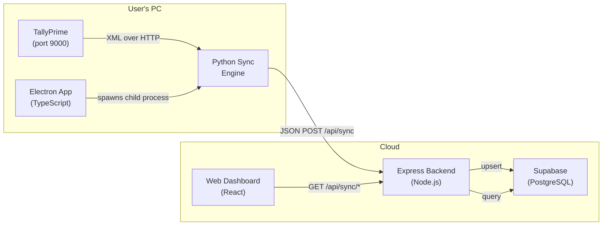
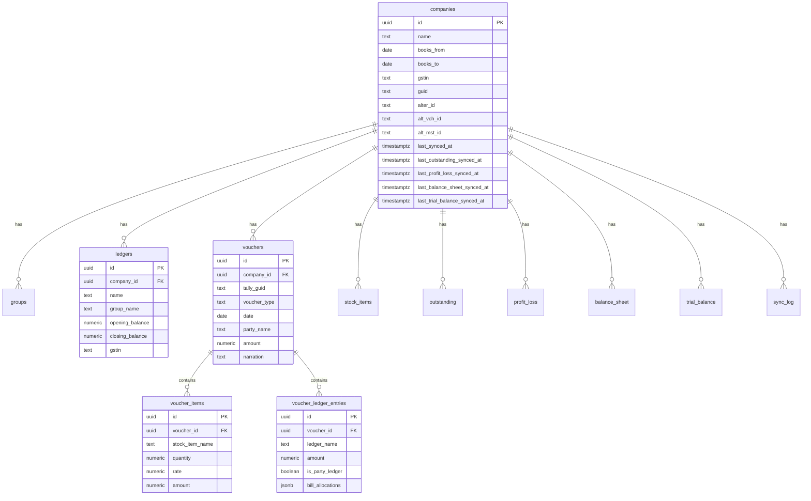
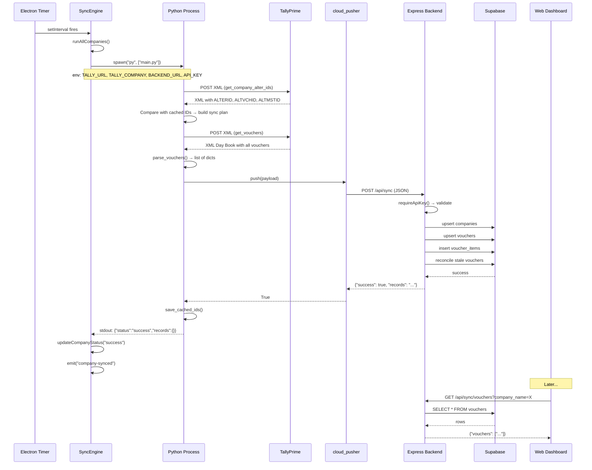

# TallyBridge — Complete Code Explainer

> **TallyBridge** is a Windows desktop application that automatically extracts accounting data from **TallyPrime** (India's most widely-used accounting software) and pushes it to a cloud database (Supabase), where it can be consumed by web dashboards or third-party apps.

---

## Table of Contents

1. [High-Level Architecture](#1-high-level-architecture)
2. [Technology Stack](#2-technology-stack)
3. [Project Structure](#3-project-structure)
4. [Layer 1 — Electron Main Process](#4-layer-1--electron-main-process)
5. [Layer 2 — Python Sync Engine](#5-layer-2--python-sync-engine)
6. [Layer 3 — Cloud Backend (Express + Supabase)](#6-layer-3--cloud-backend-express--supabase)
7. [Layer 4 — Electron Renderer (Desktop UI)](#7-layer-4--electron-renderer-desktop-ui)
8. [Layer 5 — Frontend Web Dashboard](#8-layer-5--frontend-web-dashboard)
9. [Database Schema](#9-database-schema)
10. [Data Flow End-to-End](#10-data-flow-end-to-end)
11. [Change Detection & Incremental Sync](#11-change-detection--incremental-sync)
12. [Security Model](#12-security-model)
13. [Build & Distribution](#13-build--distribution)

---

## 1. High-Level Architecture



**In plain English:**

1. **TallyPrime** exposes a local HTTP server on port 9000 that speaks XML (TDL — Tally Definition Language).
2. The **Electron desktop app** runs on the user's Windows machine. On a timer (every N minutes), it spawns a **Python child process**.
3. The **Python process** sends XML requests to TallyPrime, parses the XML responses into clean JSON structures, then POSTs the JSON to the cloud **Express backend**.
4. The **Express backend** receives the payload, validates it, and upserts everything into **Supabase** (hosted PostgreSQL).
5. A **React web dashboard** (separate from the Electron UI) can query the backend's GET endpoints to display the synced data anywhere — phone, browser, another PC.

---

## 2. Technology Stack

| Layer | Technology | Purpose |
|---|---|---|
| Desktop shell | Electron 41 + TypeScript | Windows desktop app, system tray, auto-launch |
| Desktop UI | React 19 + react-router-dom 7 | In-app settings, company management, sync log |
| Sync engine | Python 3 + `requests` + `xmltodict` | TallyPrime XML API client, data extraction, parsing |
| Cloud backend | Express.js + TypeScript | REST API, data validation, database writes |
| Database | Supabase (PostgreSQL) | Cloud-hosted relational database |
| Web dashboard | React 19 + Vite + Recharts | Browser-based financial data viewer |
| Bundler (desktop) | Vite 8 + electron-builder | Dev server, production build, NSIS installer |
| Persistence | electron-store | Local config (Tally URL, API key, companies) |

---

## 3. Project Structure

```
TallyBridge/
├── src/
│   ├── main/                    # Electron main process (Node.js)
│   │   ├── index.ts             # App entry: creates window, wires tray + sync
│   │   ├── preload.ts           # Bridge between main and renderer (contextBridge)
│   │   ├── ipc-handlers.ts      # IPC request handlers (config, companies, sync)
│   │   ├── store.ts             # electron-store config + company management
│   │   ├── sync-engine.ts       # Spawns Python, reads output, updates status
│   │   └── tray.ts              # System tray icon + context menu
│   │
│   ├── renderer/                # Electron renderer (React UI)
│   │   ├── main.tsx             # ReactDOM entry
│   │   ├── App.tsx              # Router: Home, AddCompany, Settings, Log, About
│   │   ├── electron.d.ts        # TypeScript declarations for window.electronAPI
│   │   ├── pages/
│   │   │   ├── HomeGuided.tsx    # Company list + "Sync All" button
│   │   │   ├── AddCompanyGuided.tsx  # Auto-detect + add from Tally
│   │   │   ├── Settings.tsx     # Tally URL, sync interval, backend config
│   │   │   ├── SyncLog.tsx      # Real-time terminal-style log viewer
│   │   │   └── About.tsx        # Version info
│   │   └── components/
│   │       ├── Sidebar.tsx      # Navigation sidebar
│   │       ├── StatusBar.tsx    # Connection status + countdown timer
│   │       └── CompanyCardStable.tsx  # Per-company status card
│   │
│   └── python/                  # Python sync engine
│       ├── main.py              # Orchestrator: change detect → fetch → push
│       ├── tally_client.py      # XML request builder + HTTP client
│       ├── xml_parser.py        # XML → JSON parsers for all data types
│       ├── definition_extractor.py  # Definition-driven data extraction
│       ├── cloud_pusher.py      # HTTP POST to cloud backend
│       ├── definitions/
│       │   └── structured_sections.json  # Declarative data extraction rules
│       └── requirements.txt     # requests, xmltodict
│
├── backend/                     # Cloud API server
│   ├── src/
│   │   ├── index.ts             # Express app setup
│   │   ├── routes/
│   │   │   └── sync.ts          # POST /api/sync + all GET endpoints
│   │   ├── db/
│   │   │   └── supabase.ts      # Supabase client init
│   │   └── middleware/
│   │       └── auth.ts          # API key middleware (timing-safe compare)
│   ├── full_schema.sql          # Complete Supabase DDL
│   └── package.json
│
├── frontend/                    # Web dashboard (separate Vite app)
│   └── src/
│       ├── pages/               # Dashboard, Sales, PnL, BS, Outstanding, etc.
│       ├── components/          # Layout, MetricCard
│       └── api/client.ts        # Axios client for backend
│
├── package.json                 # Root Electron package
├── vite.config.ts               # Vite config (renders from src/renderer/)
├── electron-builder.yml         # NSIS installer configuration
└── tsconfig.json / tsconfig.main.json
```

---

## 4. Layer 1 — Electron Main Process

### 4.1 Entry Point — [index.ts](file:///d:/Desktop/TallyBridge/src/main/index.ts)

This is the Electron application's `main` entry. When the app is ready:

1. **Creates the BrowserWindow** (900×620) with `contextIsolation: true` and `nodeIntegration: false` — a security best practice that prevents the renderer from directly accessing Node.js APIs.
2. In **dev mode**, loads `http://localhost:5173` (Vite dev server) and opens DevTools. In **production**, loads the built `index.html` from `dist/renderer/`.
3. The window is hidden on close (minimized to tray) rather than quitting — the app is designed to run persistently as a background sync service.
4. **Instantiates three subsystems:**
   - `SyncEngine` — the heart of the app, manages periodic data sync
   - `setupTray()` — system tray icon with sync status
   - `setupIpcHandlers()` — exposes config/sync operations to the UI
5. Wires lifecycle callbacks so the tray icon reflects sync status (idle → syncing → success/error).
6. Calls `syncEngine.start()` to begin auto-syncing.

### 4.2 Preload Script — [preload.ts](file:///d:/Desktop/TallyBridge/src/main/preload.ts)

The preload script is the **secure bridge** between the Electron main process and the renderer (browser) process. It uses `contextBridge.exposeInMainWorld` to create a `window.electronAPI` object with these methods:

| Method | IPC Channel | Purpose |
|---|---|---|
| `getConfig()` | `get-config` | Read all settings |
| `saveSettings(s)` | `save-settings` | Save Tally URL, interval, backend config |
| `addCompany(selection)` | `add-company` | Register a Tally company |
| `removeCompany(id)` | `remove-company` | Remove a company |
| `getCompanies()` | `get-companies` | List all registered companies |
| `syncNow()` | `sync-now` | Trigger immediate sync |
| `checkTally()` | `check-tally` | Test Tally connectivity |
| `getTallyCompanies()` | `get-tally-companies` | Auto-discover companies open in Tally |
| `on(channel, cb)` | - | Subscribe to events from main process |
| `off(channel, cb)` | - | Unsubscribe from events |

Event channels are **whitelisted** to prevent arbitrary IPC listening:
`sync-log`, `sync-start`, `sync-complete`, `company-status-change`, `company-synced`, `company-error`, `companies-updated`

### 4.3 IPC Handlers — [ipc-handlers.ts](file:///d:/Desktop/TallyBridge/src/main/ipc-handlers.ts)

This file registers all `ipcMain.handle()` processors. Key behaviors:

#### Tally Communication
- **`postTallyXml()`** — Sends XML requests to TallyPrime via HTTP POST. Uses `Buffer.from(xml, "utf8")` because Tally can be finicky about encoding. Timeout is 5 seconds.
- **`decodeTallyResponse()`** — Tally sometimes responds in UTF-16 encoding. This function sniffs the response (BOM markers, null-byte patterns, content-type header) and auto-decodes appropriately. This is critical because Tally's encoding behavior is inconsistent across versions and configurations.

#### Company Discovery
- **`get-tally-companies`** — Sends a TDL (Tally Definition Language) Collection request that fetches `NAME`, `GUID`, and `BASICCOMPANYFORMALNAME` for every company open in TallyPrime. The response XML is parsed using regex-based extraction (`parseTallyCompanies`), with a fallback that searches for any `<NAME>` tags if the structured `<COMPANY>` blocks aren't found.

#### Company Management
- **`add-company`** — Validates the company name, checks for duplicates (by GUID first, then by normalized name), verifies Tally connectivity by sending a test XML request, then persists the company to `electron-store`. After adding, pushes a `companies-updated` event to the renderer.
- **`remove-company`** — Removes by UUID, notifies the renderer.

#### Settings
- **`save-settings`** — Persists Tally URL, sync interval, backend URL, API key, and account email. Calls `engine.reschedule()` to apply the new interval immediately.

### 4.4 Store — [store.ts](file:///d:/Desktop/TallyBridge/src/main/store.ts)

Uses `electron-store` to persist configuration as a JSON file on disk (`tallybridge-config.json` in the app's userData directory).

**Data Model:**

```typescript
interface AppConfig {
  tallyUrl: string;           // default: "http://localhost:9000"
  syncIntervalMinutes: number; // default: 5
  backendUrl: string;          // Cloud backend URL
  apiKey: string;              // Secret API key
  accountEmail: string;        // User's email
  companies: Company[];        // Registered companies
}

interface Company {
  id: string;            // UUID (generated locally)
  name: string;          // TallyPrime company name
  tallyGuid?: string;    // TallyPrime GUID for unique identification
  formalName?: string;    // Legal/formal name
  enabled: boolean;       // Whether to include in sync
  addedAt: string;        // ISO timestamp
  lastSyncedAt?: string;
  lastSyncStatus?: "success" | "error" | "syncing" | "idle";
  lastSyncRecords?: SyncRecordCounts;
  lastSyncError?: string;
}
```

The `SyncRecordCounts` interface tracks how many records were synced per section: groups, ledgers, vouchers, stock, outstanding, profit_loss, balance_sheet, trial_balance.

`updateCompanyStatus()` performs an immutable update on the companies array — maps over all companies and spreads the partial update into the matching one.

### 4.5 Sync Engine — [sync-engine.ts](file:///d:/Desktop/TallyBridge/src/main/sync-engine.ts)

This is the **core orchestrator** on the Electron side. It manages the sync lifecycle:

#### Scheduling
- `start()` — Runs one sync immediately after a 3-second delay, then starts the interval timer.
- `scheduleNext()` — Creates a `setInterval` based on `syncIntervalMinutes` from the config store.
- `reschedule()` — Called when the user changes settings; clears and recreates the timer.
- `syncNow()` — Manual trigger; rejected with a log message if already syncing.

#### Sync Execution — `runAllCompanies()`
1. Checks `isSyncing` flag to prevent concurrent runs.
2. Filters to enabled companies only.
3. Emits `sync-start` to the renderer.
4. Sequentially processes each company via `syncOneCompany()`.
5. In the `finally` block, emits `sync-complete` and refreshes the UI.

#### Per-Company Sync — `syncOneCompany()`

This method **spawns a Python child process** for each company. The key design decision is isolation: each company gets its own Python process, so a crash or timeout in one doesn't affect others.

**Environment variables passed to Python:**
- `TALLY_URL` — Where TallyPrime is running
- `TALLY_COMPANY` — Company name to sync
- `TALLY_COMPANY_GUID` — Unique identifier (if available)
- `TB_FORCE_FULL_SYNC` — Set to `"1"` if the company has never been synced
- `BACKEND_URL` — Cloud backend URL
- `API_KEY` — Authentication key
- `TB_USER_DATA_DIR` — Electron's userData path (for the alter-ID cache)

**Python path resolution:**
- **Dev mode:** Uses `py -3` (Windows) or `python3` (Mac/Linux) and the source script path
- **Production:** Uses a bundled `tallybridge-engine.exe` (PyInstaller)

**Output handling:**
- `stdout` → Split into lines, each emitted as `sync-log` events to the renderer, also stored in `outputLines`
- `stderr` → Captured as error output, emitted as `[ERR]` log lines
- The **last JSON line** from stdout is parsed as the result summary (status, record counts, voucher sync mode)

**Timeout mechanism:**
- Default 5-minute timeout, configurable via `TB_SYNC_PROCESS_TIMEOUT_MS`
- On timeout, the process is killed and the company is marked as errored

**Finalization (`finalize`):**
- On **success** (exit code 0): Parses the JSON summary, merges record counts (using `mergeRecordCounts` which preserves previous values for any section not reported), updates the company status to "success"
- On **failure**: Constructs an error message from stderr, timeout message, or a default, updates status to "error"
- A `settled` flag prevents double-finalization from race conditions between `close` and `error` events.

**Record count normalization:**
`normalizeRecordCounts()` and `mergeRecordCounts()` handle the fact that not every sync updates every section. If a sync only updated vouchers, the groups/ledgers counts from the previous sync are preserved.

### 4.6 System Tray — [tray.ts](file:///d:/Desktop/TallyBridge/src/main/tray.ts)

Creates a system tray icon with a context menu:
- **Status indicator** — "● Ready", "● Syncing...", or "● Error — open app"
- **Open TallyBridge** — Shows the main window
- **Sync Now** — Triggers immediate sync
- **Quit TallyBridge** — Actually exits (unlike the window close button which only hides)

The tray icon path resolves differently in dev (from `assets/`) vs production (from Electron's `resourcesPath`).

---

## 5. Layer 2 — Python Sync Engine

The Python engine is the **data extraction workhorse**. It speaks TallyPrime's XML API, parses complex XML responses, and pushes clean JSON payloads to the cloud.

### 5.1 Orchestrator — [main.py](file:///d:/Desktop/TallyBridge/src/python/main.py)

The main sync flow has 5 phases:

#### Phase 0: Company Info
- Fetches company metadata (FY dates, GSTIN, address) from TallyPrime
- Uses `BOOKSFROM` / `BOOKSTO` to determine the financial year date range
- Falls back to India's standard April-March FY if the company info fetch fails
- If `BOOKSTO` is missing but `BOOKSFROM` exists, derives the FY end as `BOOKSFROM + 1 year - 1 day`
- Caps the "to" date at today's date (no future data)

#### Phase 1: Change Detection
- Fetches `ALTERID`, `ALTVCHID`, `ALTMSTID` — TallyPrime's internal change counters
- Compares current values against cached values from the last successful sync
- Also queries the **cloud backend** for its alter IDs to handle first-sync and re-sync scenarios
- Builds a **sync plan** that specifies exactly what needs refreshing

The sync plan can result in:
- **No sync** — If none of the alter IDs have changed
- **Full sync** — First sync, cache corruption, forced sync, or backend has no data
- **Selective sync** — Only master data changed, only vouchers changed, etc.
- **Incremental voucher sync** — If enabled and conditions allow, only fetches vouchers from a date window (7-day overlap for safety)

#### Phase 2: Data Fetching

For each section that the sync plan says needs refreshing, the engine:
1. **First tries** the definition-driven extractor (`fetch_structured_section()`) — a generic, JSON-configurable approach
2. **Falls back** to the legacy hand-coded parser if the structured approach fails

Sections fetched:

| Section | Tally Request | Data Extracted |
|---|---|---|
| Groups | Collection: Group | Chart of accounts hierarchy |
| Ledgers | Collection: Ledger | All accounts with balances, contact info |
| Vouchers | Day Book report | Every transaction: sales, purchases, receipts, payments |
| Stock Items | Collection: StockItem + Stock Summary | Inventory with quantities, values, rates |
| Outstanding | Bills Receivable + Bills Payable | Pending customer/vendor bills with due dates |
| Profit & Loss | P&L report | Revenue/expense breakdown |
| Balance Sheet | Balance Sheet report | Assets/liabilities snapshot |
| Trial Balance | Trial Balance report | Debit/credit summary by account |

#### Phase 3: Cloud Push
- Assembles the full payload including `company_name`, `company_guid`, `company_info`, `alter_ids`, all data sections, and `sync_meta` (which tells the backend whether vouchers are full or incremental)
- Calls `push()` which POSTs to `POST /api/sync`

#### Phase 4: Cache Update
- Saves the current alter IDs to `.alter_ids_cache.json` using an atomic-replace pattern (write to temp file, then `os.replace()`) with retries for Windows file-locking issues

#### Final Output
- The **last line of stdout** is a JSON object: `{"status": "success", "records": {...}, "voucher_sync_mode": "full"}` — this is what the Electron `SyncEngine` parses to update the UI.

### 5.2 Tally Client — [tally_client.py](file:///d:/Desktop/TallyBridge/src/python/tally_client.py)

The HTTP client for TallyPrime's XML API.

#### Core Infrastructure
- **`_post(xml)`** — POSTs XML to `TALLY_URL` with UTF-8 encoding, 30-second timeout
- **`_decode_response()`** — Handles Tally's encoding quirks. Tries multiple UTF-16 variants if the response looks like UTF-16 (BOM detection, null-byte sniffing), falls back to UTF-8
- **`_check_response()`** — Validates the response XML: looks for `<STATUS>0</STATUS>` (failure) or `<LINEERROR>` tags, extracts error descriptions, strips HTML from error messages
- **`_fetch(xml)`** — Combines `_post` and `_check_response`

#### Request Types

TallyPrime supports two main XML request patterns:

1. **Collection requests** (structured data) — Uses TDL `<COLLECTION>` with `<FETCH>` tags to specify exact fields. Returns clean XML like `<COLLECTION><LEDGER>...</LEDGER></COLLECTION>`. Used for: company info, alter IDs, groups, ledgers, stock items.

2. **Data/Report requests** (display data) — Uses `<TYPE>Data</TYPE>` with a report `<ID>`. Returns Tally's display-format XML (TALLYMESSAGE blocks, DSP-prefixed tags). Used for: vouchers (Day Book), outstanding (Bills Receivable/Payable), P&L, Balance Sheet, Trial Balance.

Every request includes `<SVCURRENTCOMPANY>` to target the specific company and `<SVEXPORTFORMAT>$$SysName:XML</SVEXPORTFORMAT>` to get XML output.

### 5.3 XML Parser — [xml_parser.py](file:///d:/Desktop/TallyBridge/src/python/xml_parser.py)

Converts TallyPrime's XML into clean Python dictionaries. Each parser handles the complexity and inconsistency of Tally's output.

#### Helper Functions
- **`clean_xml()`** — Removes control characters that break XML parsing
- **`safe_float()`** — Extracts numbers from strings, dicts (xmltodict wraps tagged values), handles commas, units, and currency symbols
- **`safe_int()`** — Integer variant for IDs
- **`safe_str()`** — Extracts text from potential dict values (xmltodict's `{"#text": "value", "@TYPE": "attr"}` pattern)
- **`parse_tally_date()`** — Handles multiple date formats: `YYYYMMDD`, `DD-Mon-YY`, `DD-Mon-YYYY`, `DD-MM-YYYY`

#### Section Parsers

**`parse_company_info()`** — Extracts from `COLLECTION > COMPANY`: name, FY dates (with derivation if `books_to` is missing), GUID, address, GSTIN, PAN, email, phone.

**`parse_alter_ids()`** — Extracts change-detection counters: `ALTERID`, `ALTVCHID`, `CMPVCHID`, `ALTMSTID`, `LASTVOUCHERDATE`.

**`parse_groups()`** — Maps each `GROUP` element to `{name, parent, master_id, is_revenue, affects_stock, is_subledger}`.

**`parse_ledgers()`** — Handles both Collection format and legacy TALLYMESSAGE format. Extracts 16 fields per ledger including opening/closing balance, contact details, banking info, GST details.

**`parse_vouchers()`** — The most complex parser. For each voucher in the Day Book:
- Extracts header fields: type, GUID, number, date, party, amount, narration
- Skips cancelled and optional vouchers
- Parses **inventory entries**: stock item name, quantity (with unit extraction from "10 Nos" format), rate, discount, amount
- Parses **ledger entries** (accounting lines): ledger name, amount, party flag, debit/credit direction, and bill allocations
- **Derives amount** if the voucher-level amount is 0: sums item amounts, or takes the party-ledger amount, or the largest absolute ledger entry

**`parse_stock()`** — Two-stage parser:
1. First tries xmltodict-based parsing from Collection format
2. Falls back to regex extraction from Tally's display format (`DSPDISPNAME`, `DSPCLQTY`, `DSPCLRATE`, `DSPCLAMTA` tags)

**`parse_outstanding()`** — Regex-based extraction from Bills Receivable/Payable reports. Extracts party, reference, dates, and overdue days from `BILLFIXED`/`BILLCL`/`BILLDUE`/`BILLOVERDUE` tag groups.

**`parse_profit_and_loss()`** — Extracts from display-format XML using `DSPDISPNAME` + `PLSUBAMT` (or `BSMAINAMT` fallback). Determines debit/credit from sign.

**`parse_balance_sheet()`** — Extracts from display format. Uses `BSMAINAMT` + `BSSUBAMT` for main amounts, or `DSPCLDRAMTA` + `DSPCLCRAMTA` for debit/credit format. Classifies as "asset" or "liability" based on sign.

**`parse_trial_balance()`** — Simple extraction: name + debit amount + credit amount from display tags.

### 5.4 Definition Extractor — [definition_extractor.py](file:///d:/Desktop/TallyBridge/src/python/definition_extractor.py)

A **generic, JSON-driven data extraction system** that replaces hand-coded parsers with declarative definitions stored in [structured_sections.json](file:///d:/Desktop/TallyBridge/src/python/definitions/structured_sections.json).

#### Architecture

Instead of writing a custom parser for each Tally report, you define:
```json
{
  "section_name": {
    "request": { "what TDL XML to send" },
    "response": { "how to parse the response" }
  }
}
```

#### Request Building — `build_collection_request()`
Takes the request definition and generates the TDL XML envelope:
- Sets static variables (export format, current company, date range)
- Supports template variables like `{{from_date}}` resolved from request context
- Builds Collection XML with type, fetch fields, filters, and system formulae
- Supports both `Collection` and `Data` request types

#### Response Parsing

Three parsing modes:

1. **Standard mode** — Navigates to a `row_tag` within the Collection response, applies field transformations to each row
2. **Single mode** — Same as standard but returns only the first row (used for company info)
3. **Indexed rows mode** — For display-format data (P&L, Balance Sheet, Trial Balance) where data is in parallel arrays (all names, all amounts, etc.). Builds "virtual rows" by zipping the arrays by index.

#### Field Transformations
Each field definition specifies:
- `sources` — An ordered list of XML paths to try (first non-empty wins)
- `transform` — How to convert the value: `string`, `int`, `float`, `abs_float`, `date`, `quantity_value_abs`, `quantity_unit`, `bool_yesno`
- `default` — Fallback if all sources are empty

#### Row Finalization — `_finalize_section_row()`
Section-specific post-processing:
- **Vouchers**: Derives amount from items/ledger entries if zero
- **Profit & Loss**: Extracts raw amount, computes `is_debit` from sign
- **Balance Sheet**: Determines asset/liability side from amount sign or debit/credit columns
- **Trial Balance**: Normalizes debit/credit to absolute values

### 5.5 Cloud Pusher — [cloud_pusher.py](file:///d:/Desktop/TallyBridge/src/python/cloud_pusher.py)

Handles HTTP communication with the cloud backend.

**`fetch_remote_alter_ids()`** — Makes a `GET /api/sync/alter-ids` request to check what the backend already knows about this company. Returns a `(data, status)` tuple where status can be:
- `"ok"` — Backend found the company and returned its alter IDs
- `"company_not_found"` — Company doesn't exist yet (triggers forced full sync)
- `"backend_unconfigured"` — No backend URL set (sync runs but doesn't push)
- Various error states

**`push(payload)`** — POSTs the full sync payload to `POST /api/sync`:
- 120-second timeout (configurable via `BACKEND_TIMEOUT_SECONDS`)
- Returns `True` on success, `False` on failure
- Handles connection errors gracefully (backend might be down)

---

## 6. Layer 3 — Cloud Backend (Express + Supabase)

### 6.1 Server Setup — [index.ts](file:///d:/Desktop/TallyBridge/backend/src/index.ts)

A minimal Express server:
- CORS enabled (for web dashboard access)
- JSON body limit: 100MB (configurable via `TB_JSON_BODY_LIMIT`) — necessary because a full sync payload with thousands of vouchers can be large
- Mounts `syncRouter` at `/api/sync`
- Health check at `/health`

### 6.2 Auth Middleware — [auth.ts](file:///d:/Desktop/TallyBridge/backend/src/middleware/auth.ts)

Every API request requires an `x-api-key` header. The middleware:
- Extracts the key from the request header
- Compares against `process.env.API_KEY` using **`timingSafeEqual`** — this prevents timing attacks where an attacker could deduce the key length or prefix by measuring response times

### 6.3 Sync Routes — [sync.ts](file:///d:/Desktop/TallyBridge/backend/src/routes/sync.ts)

This is the **largest and most complex file** in the backend (1,206 lines). It handles all data ingestion and retrieval.

#### Utility Functions

**Batch operations:**
- `chunkArray(items, 250)` — Splits arrays into chunks of 250 for Supabase's batch limits
- `upsertInBatches()` — Upserts rows in chunks, using a conflict key (e.g., `company_id,name`)
- `insertInBatches()` — Inserts rows in chunks (no conflict handling)
- `insertReturningIdsInBatches()` — Inserts and returns the generated UUIDs for each row (needed for voucher items/entries that reference the voucher's DB ID)
- `deleteByEq()` / `deleteByIn()` — Batch-safe delete operations

**Rollback infrastructure:**
- `rollbackInsertedRows()` — Deletes recently-inserted rows if a later step fails
- `restoreRows()` — Re-inserts previously-deleted rows if a step fails
- This provides a manual pseudo-transactional guarantee since Supabase doesn't support multi-table transactions via the REST API

#### Company Lookup — `resolveCompanyLookup()`

Companies can be identified three ways (in priority order):
1. `company_id` — Direct UUID lookup
2. `company_guid` — TallyPrime's GUID (best for same-name companies)
3. `company_name` — Name match (rejects if ambiguous — multiple companies share the name)

Returns the company's metadata including per-section sync timestamps, which are used to serve the correct "snapshot" of data.

#### Company Upsert — `upsertCompanyRecord()`

The company upsert logic handles several edge cases:
1. If a GUID is provided, tries to find-by-GUID first and updates
2. If not found by GUID, tries by name; rejects if multiple names exist
3. If matched by name and no conflicting GUID, updates
4. Otherwise, inserts a new company
5. Includes the `companies_name_key` constraint error handling for legacy schemas

#### POST /api/sync — The Main Sync Endpoint

This is the endpoint that receives the full data payload from the Python engine.

**Step 1: Validate** — Checks company_name exists, validates all section arrays (must be arrays if present, max 100K rows).

**Step 2: Upsert Company** — Creates or updates the company record with metadata + alter IDs.

**Step 3: Upsert Groups** — Simple upsert on `(company_id, name)`.

**Step 4: Upsert Ledgers** — Same pattern, on `(company_id, name)`.

**Step 5: Upsert Vouchers** — The most complex operation:
1. Filters to vouchers with valid `tally_guid`
2. Upserts voucher header rows on `(company_id, tally_guid)`
3. Fetches the generated DB IDs via `getVoucherIdMap()`
4. **Snapshots existing** voucher_items and voucher_ledger_entries
5. **Inserts new** items and entries
6. **Deletes old** items and entries
7. If any step fails, **rollbacks** inserted rows and **restores** deleted rows
8. **Reconciles** — Deletes vouchers that exist in the DB but weren't in the incoming payload (handles deleted/cancelled vouchers in Tally). For incremental sync, only reconciles within the date window.

**Steps 6-8: Snapshot Sections** (outstanding, P&L, BS, trial balance)
These sections use a **snapshot pattern**: each sync inserts new rows with a `synced_at` timestamp. After successful insert, old rows (from previous syncs) are deleted. The company record stores `last_X_synced_at` timestamps so GET queries always serve the latest complete snapshot.

**Step 9: Sync Log** — Best-effort insert into `sync_log` table.

#### GET Endpoints — Data Retrieval

| Endpoint | Returns | Notes |
|---|---|---|
| `GET /api/sync/vouchers` | All vouchers + items | Sorted by date descending |
| `GET /api/sync/outstanding` | Outstanding bills | Uses snapshot timestamp, sorted by overdue days |
| `GET /api/sync/stock` | Stock items | Latest values |
| `GET /api/sync/pnl` | Profit & Loss | Uses snapshot timestamp |
| `GET /api/sync/balance-sheet` | Balance Sheet | Uses snapshot timestamp |
| `GET /api/sync/alter-ids` | Company's alter IDs | For change detection from desktop |
| `GET /api/sync/parties` | Party list + summary | Derived from Sundry Debtors/Creditors ledgers |
| `GET /api/sync/party-ledger` | Full party history | Transactions + running balance + outstanding |

All GET endpoints accept `company_id`, `company_guid`, or `company_name` as query parameters.

#### Party Ledger — Derived Data

The `GET /party-ledger` endpoint is notable because it **derives** data that doesn't exist in TallyPrime:
1. Fetches all vouchers for a party, sorted chronologically
2. Computes a **running balance** by examining each voucher's ledger entries
3. Determines debit/credit direction from `is_deemed_positive` flag or voucher type heuristics
4. Returns the ledger's current info, outstanding summary, and transaction history with running balances

---

## 7. Layer 4 — Electron Renderer (Desktop UI)

### 7.1 App Layout — [App.tsx](file:///d:/Desktop/TallyBridge/src/renderer/App.tsx)

The desktop UI uses `HashRouter` (necessary for Electron's `file://` protocol) with a persistent sidebar + status bar layout:

```
┌──────────────────────────────────────────────┐
│  ┌─────────┐  ┌──────────────────────────┐   │
│  │ Sidebar │  │                          │   │
│  │         │  │    Page Content           │   │
│  │  Home   │  │    (Router outlet)        │   │
│  │  Log    │  │                          │   │
│  │  Gear   │  │                          │   │
│  │  About  │  │                          │   │
│  │         │  │                          │   │
│  │  v1.0.0 │  └──────────────────────────┘   │
│  └─────────┘                                  │
│  ┌────────────────────────────────────────┐   │
│  │  StatusBar: Tally • Internet • Timer   │   │
│  └────────────────────────────────────────┘   │
└──────────────────────────────────────────────┘
```

### 7.2 Pages

**Home** ([HomeGuided.tsx](file:///d:/Desktop/TallyBridge/src/renderer/pages/HomeGuided.tsx)) — Displays company cards. Subscribes to `companies-updated`, `sync-start`, `sync-complete` events for real-time updates. "Sync All Now" button triggers `window.electronAPI.syncNow()`. Handles duplicate company names by showing identity hints (formal name or GUID suffix).

**Add Company** ([AddCompanyGuided.tsx](file:///d:/Desktop/TallyBridge/src/renderer/pages/AddCompanyGuided.tsx)) — A multi-step wizard:
1. **Loading** — Calls `getTallyCompanies()` to auto-discover companies
2. **Select** — Shows company cards with radio-select UX
3. **Checking** — Verifies with Tally via `addCompany()`
4. **Success/Error** — Result screen with navigation

Companies are keyed by `guid || "name::formalName"` for unique identification.

**Settings** ([Settings.tsx](file:///d:/Desktop/TallyBridge/src/renderer/pages/Settings.tsx)) — Two sections:
- *TallyPrime Connection*: URL input + "Test" button, sync interval dropdown (1-60 min)
- *Cloud Account*: Backend URL, API key (password field), email

**Sync Log** ([SyncLog.tsx](file:///d:/Desktop/TallyBridge/src/renderer/pages/SyncLog.tsx)) — A terminal-style log viewer:
- Dark background, monospace font, color-coded (green for normal, red for errors)
- Subscribes to `sync-log` events
- Caps at 500 lines, auto-scrolls to bottom
- Timestamps in `en-IN` locale

### 7.3 Components

**Sidebar** ([Sidebar.tsx](file:///d:/Desktop/TallyBridge/src/renderer/components/Sidebar.tsx)) — Dark navy sidebar with nav links (Home, Sync Log, Settings, About). Uses `NavLink` with active-state styling.

**StatusBar** ([StatusBar.tsx](file:///d:/Desktop/TallyBridge/src/renderer/components/StatusBar.tsx)) — Bottom bar showing:
- Tally connection status (green/red dot, polled every 10 seconds)
- Internet status
- Countdown timer to next auto-sync

**CompanyCardStable** ([CompanyCardStable.tsx](file:///d:/Desktop/TallyBridge/src/renderer/components/CompanyCardStable.tsx)) — Per-company status card:
- Color-coded status dot (gray=idle, yellow=syncing, green=success, red=error)
- Company name + identity hint
- Status-specific content: sync time + record counts, or error message, or "Click Sync All to start"
- Remove button with confirmation dialog

---

## 8. Layer 5 — Frontend Web Dashboard

A separate Vite + React application (in `frontend/`) designed to display synced data in a browser. It communicates with the same Express backend but over the internet.

**Pages available:**
- Dashboard — Summary metrics
- Sales — Voucher/transaction list
- Outstanding — Receivables and payables
- Inventory — Stock items
- Profit & Loss — Financial report
- Balance Sheet — Financial report
- Parties — Customer/vendor list

The API client ([client.ts](file:///d:/Desktop/TallyBridge/frontend/src/api/client.ts)) uses Axios to call the backend's GET endpoints.

> [!NOTE]
> The frontend `App.tsx` is currently empty — this layer appears to be work-in-progress.

---

## 9. Database Schema

The Supabase PostgreSQL database has **11 tables**:



**Key design decisions:**

1. **Composite unique constraints** — `(company_id, name)` for groups/ledgers/stock, `(company_id, tally_guid)` for vouchers. Enables upsert behavior.
2. **Snapshot tables** — outstanding, P&L, balance sheet, trial balance use `synced_at` timestamps rather than upsert. This prevents stale rows from persisting if Tally removes entries between syncs.
3. **Partial unique index** on `companies.guid` — `WHERE guid IS NOT NULL AND guid <> ''`. Allows multiple companies without GUIDs while enforcing uniqueness when GUIDs exist.
4. **Cascading deletes** — All child tables reference `companies(id) ON DELETE CASCADE`.
5. **Performance indexes** — On all foreign keys plus common query patterns: `(company_id, date DESC)`, `(company_id, party_name)`, `(company_id, synced_at DESC)`.

---

## 10. Data Flow End-to-End

Here's the complete journey of a single data point (e.g., a sales invoice) from Tally to the web dashboard:



---

## 11. Change Detection & Incremental Sync

TallyBridge's change detection system is designed to **avoid re-syncing data that hasn't changed**, which is critical for performance and API usage.

### How TallyPrime's Alter IDs Work

TallyPrime maintains internal counters:
- **ALTERID** — Increments on any change (master or voucher)
- **ALTVCHID** — Increments only when vouchers change
- **ALTMSTID** — Increments only when master data changes (groups, ledgers, stock items)

### Three-Level Cache Check

1. **Local cache** (`.alter_ids_cache.json`) — Fast, per-company comparison
2. **Remote backend** (`GET /api/sync/alter-ids`) — Handles cases where local cache is stale or missing
3. **Force flags** — `TB_FORCE_FULL_SYNC=1` for first sync or explicit force

### Sync Plan Matrix

| Change | ALTERID | ALTVCHID | ALTMSTID | What Gets Synced |
|---|---|---|---|---|
| No changes | Same | Same | Same | Nothing (skip) |
| Voucher only | Changed | Changed | Same | Vouchers + stock + outstanding + reports |
| Master only | Changed | Same | Changed | Groups + ledgers + stock |
| Both | Changed | Changed | Changed | Everything |
| First sync | - | - | - | Everything (forced) |

### Incremental Voucher Sync

When enabled (`TB_ENABLE_INCREMENTAL_VOUCHER_SYNC=1`):
- Instead of fetching all vouchers for the entire FY, only fetches from `last_known_voucher_date - 7 days` to today
- The 7-day overlap (`VOUCHER_OVERLAP_DAYS`) accounts for backdated vouchers
- The backend reconciles within the date window, deleting vouchers that no longer exist in Tally for that range

---

## 12. Security Model

| Concern | Solution |
|---|---|
| Node.js in renderer | `contextIsolation: true`, `nodeIntegration: false` |
| Arbitrary IPC | Whitelisted event channels in preload |
| API authentication | `x-api-key` header on every request |
| Timing attacks | `crypto.timingSafeEqual` for key comparison |
| TallyPrime access | Local HTTP only (localhost:9000) — no internet exposure |
| Secrets storage | `electron-store` (encrypted on some OSes) — API key stored locally |
| SQL injection | Supabase's parameterized queries via SDK |
| Payload size limits | `MAX_SECTION_ROWS = 100,000` and `100MB` body limit |

---

## 13. Build & Distribution

### Development
```bash
npm run dev
# Runs Vite dev server (port 5173) + Electron in parallel via concurrently
# Uses wait-on to ensure Vite is ready before Electron starts
```

### Production Build
```bash
npm run build
# Step 1: vite build → dist/renderer/ (static HTML/JS/CSS)
# Step 2: tsc -p tsconfig.main.json → dist/main/ (compiled TS → JS)

npm run dist
# Combines build + electron-builder → NSIS installer in release/
```

### Installer Configuration — [electron-builder.yml](file:///d:/Desktop/TallyBridge/electron-builder.yml)
- **Target**: NSIS installer for Windows x64
- **Bundled files**: `dist/**/*`, `package.json`
- **Extra resources**: `src/python/` → `resources/python/`, `assets/` → `resources/assets/`
- **Installer options**: Non-one-click, custom install dir, desktop + start menu shortcuts, auto-run after install
- **No auto-publish** (`publish: null`)

### Python in Production
The Python engine is bundled as extra resources. In production, the sync engine expects either:
- A bundled `tallybridge-engine.exe` (compiled via PyInstaller)
- Or the raw Python scripts in `resources/python/` (with system Python)
