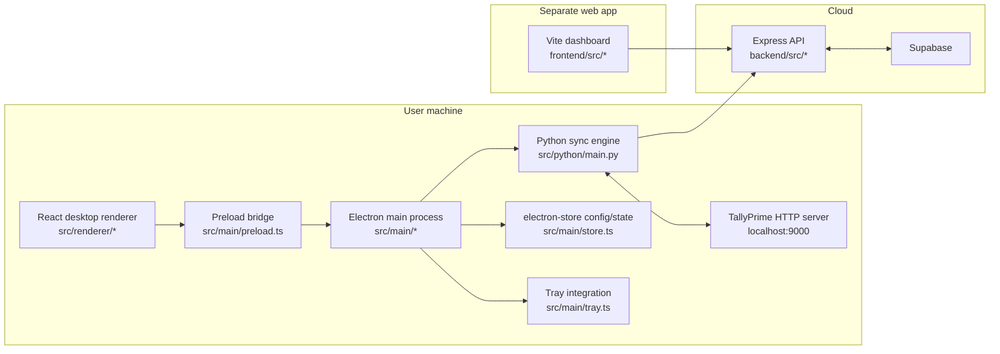
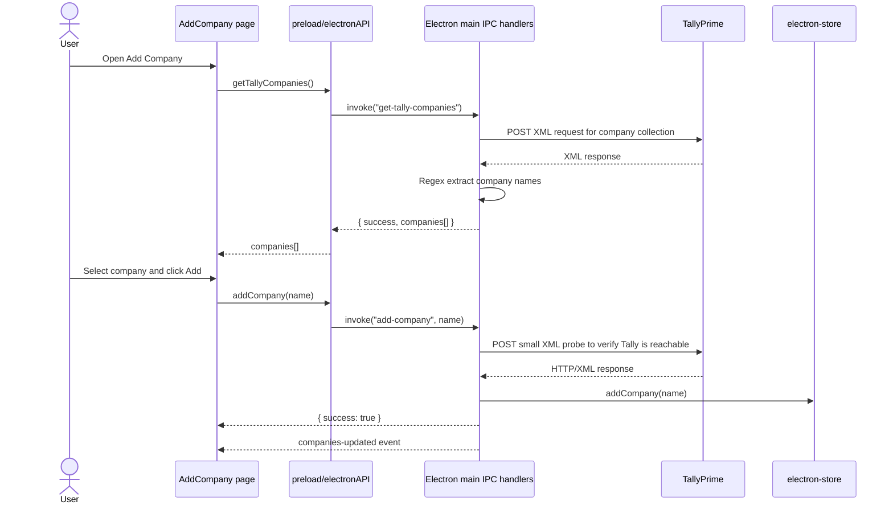
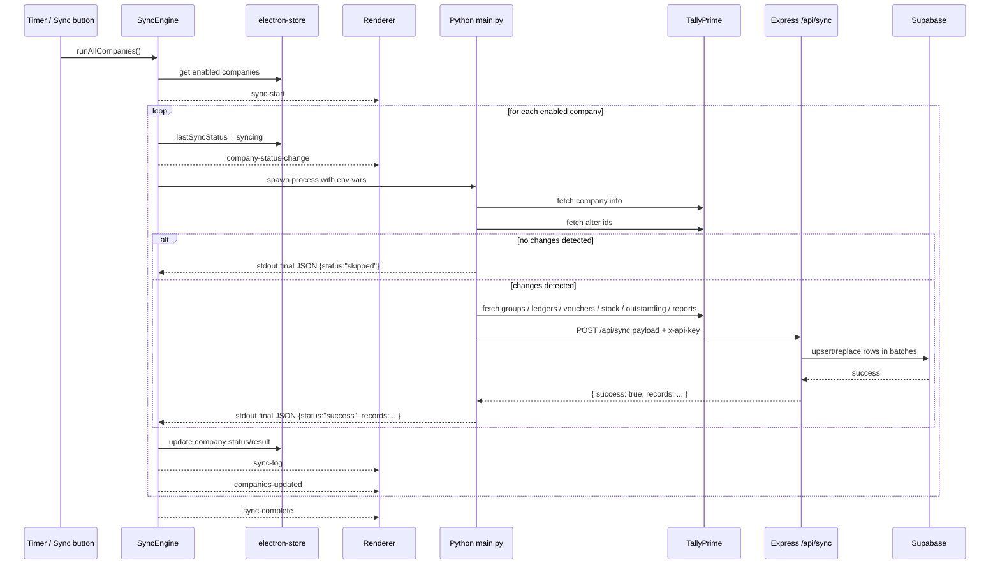
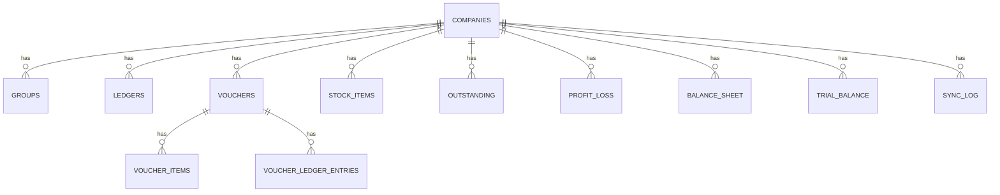

# TallyBridge Walkthrough

This document explains how the codebase works end to end, how the pieces are connected, how TallyPrime is queried, how data is transformed, and how it ends up in the backend and dashboard.

The repo actually contains 3 products plus a set of reverse-engineering tools:

1. A desktop connector app built with Electron + React + TypeScript.
2. A Python sync engine that talks to TallyPrime over XML/HTTP.
3. A cloud/backend API built with Express + Supabase.
4. A separate browser dashboard in `frontend/` that reads synced data from the backend.

---

## 1. Big Picture

At the highest level, the architecture looks like this:



The desktop app is the operator console.
The Python process is the Tally extractor.
The backend is the persistence and query layer.
The web dashboard is a separate consumer of already-synced data.

---

## 2. Code Wireframe

This is the practical map of the repo, with the important files only:

```text
TallyBridge/
  package.json                 # Electron desktop app scripts and dependencies
  vite.config.ts               # Builds src/renderer -> dist/renderer
  tsconfig.main.json           # Builds src/main -> dist/main
  electron-builder.yml         # Electron packaging config
  walkthrough.md               # This document

  src/
    main/
      index.ts                 # Electron entrypoint
      preload.ts               # Safe bridge from renderer -> main
      ipc-handlers.ts          # Main-process RPC handlers
      store.ts                 # Local persistent config + company list
      sync-engine.ts           # Scheduler + Python process orchestration
      tray.ts                  # System tray setup

    renderer/
      main.tsx                 # React bootstrap
      App.tsx                  # HashRouter + page layout
      electron.d.ts            # Type declaration for window.electronAPI
      components/
        Sidebar.tsx
        StatusBar.tsx
        CompanyCard.tsx
      pages/
        Home.tsx
        AddCompany.tsx
        Settings.tsx
        SyncLog.tsx
        About.tsx

    python/
      main.py                  # Orchestrates one sync run
      definition_extractor.py  # Generic definition-driven Tally parser
      definitions/
        structured_sections.json
      tally_client.py          # Legacy hardcoded XML request builders
      xml_parser.py            # Legacy hardcoded parsers
      cloud_pusher.py          # Pushes payload to backend
      diagnose.py              # Manual Tally diagnostic capture script
      proxy.py                 # Local proxy for inspecting BizAnalyst traffic
      tally-responses/         # Captured raw XML samples
      wireshark_requests/      # Captured raw request samples
      wireshark1.pcapng        # Packet capture artifact

  backend/
    package.json
    src/
      index.ts                 # Express server entrypoint
      routes/
        sync.ts                # Main sync write path + read APIs
      db/
        supabase.ts            # Supabase client
      middleware/
        auth.ts                # x-api-key check
    supabase_schema_v2.sql     # Incremental schema changes
    supabase_new_tables.sql    # Additional report tables

  frontend/
    package.json
    src/
      main.tsx                 # Browser dashboard bootstrap
      api/client.ts            # Axios wrapper for backend APIs
      components/
        Layout.tsx
        MetricCard.tsx
      pages/
        Dashboard.tsx
        Outstanding.tsx
        Sales.tsx
        Inventory.tsx
        Parties.tsx
        ProfitLoss.tsx
        BalanceSheet.tsx
      App.tsx                  # Currently empty / unused
```

---

## 3. What Each Layer Owns

### 3.1 Electron main process

Files:

- `src/main/index.ts`
- `src/main/preload.ts`
- `src/main/ipc-handlers.ts`
- `src/main/store.ts`
- `src/main/sync-engine.ts`
- `src/main/tray.ts`

Responsibilities:

- Creates the desktop window.
- Loads the React renderer.
- Owns trusted machine-level capabilities.
- Stores local configuration and company state.
- Spawns the Python sync engine.
- Streams sync logs into the UI.
- Exposes a controlled IPC surface to the renderer.
- Keeps the app alive in the tray when the window is closed.

The renderer does not talk to Node APIs directly. It talks through `window.electronAPI`, which is exposed by `preload.ts`.

### 3.2 React desktop renderer

Files:

- `src/renderer/App.tsx`
- `src/renderer/pages/*`
- `src/renderer/components/*`

Responsibilities:

- Gives the user pages to add companies, edit settings, inspect logs, and manually trigger sync.
- Displays state that is actually owned by the Electron main process.
- Listens to events sent from the main process.

This renderer is intentionally thin. It is mostly a UI shell over IPC methods and event streams.

### 3.3 Python sync engine

Files:

- `src/python/main.py`
- `src/python/definition_extractor.py`
- `src/python/definitions/structured_sections.json`
- `src/python/tally_client.py`
- `src/python/xml_parser.py`
- `src/python/cloud_pusher.py`

Responsibilities:

- Talks to TallyPrime over XML/HTTP.
- Detects whether anything changed since the last successful sync.
- Decides full sync vs partial sync vs incremental voucher sync.
- Converts raw Tally XML into normalized JSON-like structures.
- Posts normalized payloads to the backend.

### 3.4 Backend API

Files:

- `backend/src/index.ts`
- `backend/src/routes/sync.ts`
- `backend/src/db/supabase.ts`
- `backend/src/middleware/auth.ts`

Responsibilities:

- Accepts sync payloads from the desktop connector.
- Persists them into Supabase tables.
- Exposes read APIs for the separate dashboard.
- Applies simple API-key auth.

### 3.5 Separate web dashboard

Files:

- `frontend/src/main.tsx`
- `frontend/src/api/client.ts`
- `frontend/src/pages/*`

Responsibilities:

- Reads already-synced data from the backend.
- Does not talk to TallyPrime directly.
- Does not participate in the desktop sync loop.

This is a separate app, not the Electron renderer.

---

## 4. Boot and Runtime Flow

### 4.1 Desktop app startup

Root `package.json` is the desktop app package. In development:

- `npm run dev`
- Starts Vite for `src/renderer`
- Waits for `http://localhost:5173`
- Launches Electron

Electron startup in `src/main/index.ts` does this:

1. Creates `BrowserWindow`.
2. Loads `http://localhost:5173` in dev, or `dist/renderer/index.html` in prod.
3. Creates tray integration with `setupTray(mainWindow)`.
4. Creates `SyncEngine`.
5. Registers IPC handlers with `setupIpcHandlers(syncEngine, mainWindow)`.
6. Starts sync scheduling with `syncEngine.start()`.

Window behavior:

- Close button does not quit the app.
- `close` is intercepted, `preventDefault()` is called, and the window is hidden.
- `window-all-closed` is intentionally a no-op, so the app keeps running in the tray.

### 4.2 Local persistence

`src/main/store.ts` uses `electron-store` and persists this machine-local shape:

```ts
{
  tallyUrl: string,
  syncIntervalMinutes: number,
  backendUrl: string,
  apiKey: string,
  accountEmail: string,
  companies: Company[]
}
```

Each `Company` record in local state tracks:

- `id`
- `name`
- `enabled`
- `addedAt`
- `lastSyncedAt`
- `lastSyncStatus`
- `lastSyncRecords`
- `lastSyncError`

This local store is the desktop app's control-plane state. It is not the cloud database.

---

## 5. Renderer/Main Process Contract

`src/main/preload.ts` exposes this API into the browser window:

- `getConfig()`
- `saveSettings(settings)`
- `addCompany(name)`
- `removeCompany(id)`
- `getCompanies()`
- `syncNow()`
- `checkTally()`
- `getTallyCompanies()`
- `on(channel, callback)`
- `off(channel, callback)`

Important architectural point:

- Renderer -> main request/response uses `ipcRenderer.invoke(...)` and `ipcMain.handle(...)`.
- Main -> renderer notifications use `webContents.send(channel, data)`.

The renderer therefore behaves like a remote client to the main process.

### 5.1 IPC handlers and what they do

`src/main/ipc-handlers.ts` implements:

- `get-config`
  - Returns the full local config from `electron-store`.

- `get-companies`
  - Returns the company list only.

- `save-settings`
  - Updates `tallyUrl`, `syncIntervalMinutes`, `backendUrl`, `apiKey`, `accountEmail`.

- `add-company`
  - Verifies that TallyPrime is reachable by POSTing a simple XML request.
  - If reachable, stores the chosen company name in local state.
  - Emits `companies-updated`.

- `remove-company`
  - Deletes a company from local state.
  - Emits `companies-updated`.

- `sync-now`
  - Calls `engine.syncNow()`.

- `check-tally`
  - Probes `tallyUrl` with a UTF-16 XML request.
  - Returns `{ connected: true|false }`.

- `get-tally-companies`
  - Sends an XML request to TallyPrime.
  - Decodes the response.
  - Extracts company names with regex.

This means the Add Company page does not discover companies by using Python. It does that discovery directly from the Electron main process.

---

## 6. Desktop UI Walkthrough

### 6.1 `App.tsx`

The Electron renderer uses `HashRouter` and a fixed layout:

- Sidebar on the left.
- Main content in the middle.
- Status bar at the bottom.

Routes:

- `/` -> `Home`
- `/add-company` -> `AddCompany`
- `/settings` -> `Settings`
- `/log` -> `SyncLog`
- `/about` -> `About`

### 6.2 `Home.tsx`

Purpose:

- Lists connected companies.
- Shows sync state per company.
- Lets user trigger `Sync All Now`.

How it works:

- Loads config via `window.electronAPI.getConfig()`.
- Subscribes to:
  - `companies-updated`
  - `sync-start`
  - `sync-complete`

So the Home page is effectively a live view of main-process state.

### 6.3 `AddCompany.tsx`

Purpose:

- Auto-discovers open companies from TallyPrime.
- Lets user select one and store it locally.

State machine:

- `loading`
- `select`
- `noTally`
- `checking`
- `success`
- `error`

Important detail:

- Discovery uses `getTallyCompanies()`.
- Adding uses `addCompany(selectedName)`.
- The selected company name is stored locally; the app does not store a Tally company GUID here.

### 6.4 `Settings.tsx`

Purpose:

- Edit local connector config.

Fields:

- `tallyUrl`
- `syncIntervalMinutes`
- `backendUrl`
- `apiKey`
- `accountEmail`

It also has a `Test` button that calls `checkTally()`.

### 6.5 `SyncLog.tsx`

Purpose:

- Shows live stdout/stderr lines coming from the Python sync process.

How it works:

- Subscribes to `sync-log`.
- Keeps the latest ~500 lines.
- Auto-scrolls to bottom.

### 6.6 `StatusBar.tsx`

Purpose:

- Shows Tally connectivity.
- Shows a local countdown until next sync.

Important details:

- It polls `checkTally()` every 10 seconds.
- It loads `syncIntervalMinutes` once on mount.
- Its "Internet" indicator is hardcoded to `true`.
- Countdown is local UI state, not the source of truth for the scheduler.

### 6.7 `CompanyCard.tsx`

Purpose:

- Displays per-company status and record counts.

It renders:

- idle
- syncing
- success
- error

And shows the last synced counts for:

- ledgers
- vouchers
- stock
- outstanding

---

## 7. Add Company Sequence

This is the exact interaction path when a user adds a company:



Important nuances:

- `get-tally-companies` and `check-tally` use UTF-16 request buffers.
- `add-company` uses a simpler UTF-8 request to test connectivity.
- The verification step proves Tally is reachable, but does not deeply validate the selected company payload beyond that.

---

## 8. Sync Engine Deep Dive

The sync scheduler lives in `src/main/sync-engine.ts`.

### 8.1 Scheduler lifecycle

`start()` does 2 things:

1. Schedules one sync after 3 seconds.
2. Creates a repeating interval based on `syncIntervalMinutes`.

Pseudo-call-graph:

```text
SyncEngine.start()
  -> setTimeout(runAllCompanies, 3000)
  -> scheduleNext()

scheduleNext()
  -> minutes = store.get("syncIntervalMinutes", 5)
  -> setInterval(runAllCompanies, minutes * 60 * 1000)
```

Important actual behavior:

- The interval is read when `scheduleNext()` runs.
- Saving a new interval later updates `electron-store`, but does not re-arm the existing timer in the current process.
- In other words, interval changes are persisted immediately but scheduler behavior may not fully reflect them until restart.

### 8.2 `runAllCompanies()`

This is the main loop.

It does:

1. Reads enabled companies from the local store.
2. Emits `sync-start`.
3. For each company:
   - mark local status as `syncing`
   - emit `company-status-change`
   - call `syncOneCompany(companyId, companyName)`
4. After all companies:
   - emit `sync-complete`
   - emit `companies-updated`

### 8.3 `syncOneCompany()`

This is where Electron hands off to Python.

It:

1. Builds environment variables from local config.
2. Chooses Python execution strategy.
3. Spawns a child process.
4. Streams stdout/stderr into the UI log.
5. Waits for process exit.
6. Parses the final JSON summary line from stdout.
7. Updates local company state based on success/error/skipped behavior.

Environment passed to Python:

- `TALLY_URL`
- `TALLY_COMPANY`
- `BACKEND_URL`
- `API_KEY`

Execution mode:

- Dev:
  - uses `python` on Windows or `python3` elsewhere
  - runs `src/python/main.py`

- Prod:
  - expects `process.resourcesPath/python-runtime/tallybridge-engine.exe`
  - uses no script arg, implying a bundled executable is expected

Output contract:

- Python logs many human-readable lines.
- The last valid JSON line is treated as machine-readable summary.
- Electron looks for the last stdout line whose trimmed text starts with `{`.

That final JSON is expected to look like:

```json
{
  "status": "success",
  "records": {
    "ledgers": 123,
    "vouchers": 456,
    "stock": 20,
    "outstanding": 15
  },
  "voucher_sync_mode": "full"
}
```

### 8.4 Sync sequence diagram



---

## 9. How TallyPrime Is Queried

### 9.1 Transport

The integration model is simple but very specific:

- TallyPrime exposes an HTTP listener, usually `http://localhost:9000`.
- Requests are XML envelopes.
- Responses are XML and can come back in UTF-8 or UTF-16-like encodings.

The main sync path uses Python requests, not Axios, for the heavy data extraction.

### 9.2 XML request styles

There are 2 main request shapes in this repo:

- `Collection`
  - Used for structured object fetches like company info, groups, ledgers, stock items.

- `Data`
  - Used for report-style exports like Day Book, Bills Receivable, P&L, Balance Sheet, Trial Balance.

Typical envelope structure:

```xml
<ENVELOPE>
  <HEADER>
    <VERSION>1</VERSION>
    <TALLYREQUEST>Export</TALLYREQUEST>
    <TYPE>Collection</TYPE>
    <ID>AllLedgers</ID>
  </HEADER>
  <BODY>
    <DESC>
      <STATICVARIABLES>
        <SVEXPORTFORMAT>$$SysName:XML</SVEXPORTFORMAT>
        <SVCURRENTCOMPANY>Company Name</SVCURRENTCOMPANY>
      </STATICVARIABLES>
      <TDL>
        <TDLMESSAGE>
          <COLLECTION NAME="AllLedgers" ISMODIFY="No">
            <TYPE>Ledger</TYPE>
            <FETCH>NAME, PARENT, OPENINGBALANCE, ...</FETCH>
          </COLLECTION>
        </TDLMESSAGE>
      </TDL>
    </DESC>
  </BODY>
</ENVELOPE>
```

### 9.3 Request catalog

The current sync pipeline can ask TallyPrime for these sections:

| Section | Primary path | Fallback path | Notes |
|---|---|---|---|
| Company info | definition-driven `company_info` | `get_company_info()` + `parse_company_info()` | Gets FY dates and company metadata |
| Change markers | `get_company_alter_ids()` | none | Drives skip/incremental behavior |
| Groups | definition-driven `groups` | `get_groups()` + `parse_groups()` | Chart-of-accounts hierarchy |
| Ledgers | definition-driven `ledgers` | `get_ledgers()` + `parse_ledgers()` | Master records with contact/GST/banking fields |
| Vouchers | definition-driven `vouchers` | `get_vouchers()` + `parse_vouchers()` | Includes nested items and ledger entries |
| Stock items | definition-driven `stock_items` | `get_stock_items()` + `parse_stock()` | Structured master fetch |
| Stock summary | not primary | `get_stock_summary_report()` + `parse_stock()` | Used when structured stock is sparse |
| Outstanding receivables | definition-driven `outstanding_receivables` | `get_outstanding_receivables()` + `parse_outstanding()` | Report-style parsing |
| Outstanding payables | definition-driven `outstanding_payables` | `get_outstanding_payables()` + `parse_outstanding()` | Report-style parsing |
| Profit & Loss | definition-driven `profit_loss` | `get_profit_and_loss()` + `parse_profit_and_loss()` | Report rows normalized for DB |
| Balance Sheet | definition-driven `balance_sheet` | `get_balance_sheet()` + `parse_balance_sheet()` | Report rows normalized for DB |
| Trial Balance | definition-driven `trial_balance` | `get_trial_balance()` + `parse_trial_balance()` | Report rows normalized for DB |

### 9.4 Response decoding

`tally_client.py` has an important `_decode_response()` function.

It checks:

- `Content-Type` header
- UTF-16 BOM bytes
- null-byte patterns like `\x00<` or `<\x00`

If the response looks UTF-16-ish, it tries:

- `utf-16`
- `utf-16-le`
- `utf-16-be`

If not, it falls back to `response.text`.

This exists because Tally responses are not always stable in encoding.

### 9.5 Tally error detection

`_check_response()` inspects returned XML for:

- `<STATUS>0</STATUS>`
- `<LINEERROR>...</LINEERROR>`

If found, it raises a Python exception before parsing continues.

---

## 10. The Definition-Driven Extractor

This is one of the most important architectural ideas in the repo.

### 10.1 Why it exists

Older integrations were written as one function per request and one parser per response.
This repo now has a more generic layer:

- `src/python/definitions/structured_sections.json`
- `src/python/definition_extractor.py`

The goal is:

- define request shape in JSON
- define response path and field transforms in JSON
- let one generic engine do the fetch and parse

### 10.2 Request DSL

Each section in `structured_sections.json` declares things like:

- `id`
- `type`
- `collection_name`
- `object_type`
- `fetch`
- `filters`
- `system_formulae`
- `static_variables`

Example concepts:

- `company_info` is a collection of `Company`
- `vouchers` is a collection of `Voucher` with filters like `NOT $IsCancelled`
- reports like `profit_loss` use `type: "Data"` and date variables

### 10.3 Response DSL

Each response definition says how to turn XML into normalized rows:

- `mode`
  - `single`
  - `list`
  - `indexed_rows`

- `row_tag` or `row_path_options`
- `required_field`
- `fields`
- `children`

Transforms supported by `definition_extractor.py` include:

- `string`
- `int`
- `float`
- `abs_float`
- `date`
- `quantity_value_abs`
- `quantity_unit`
- `bool_yesno`

### 10.4 Why there are still legacy parsers

`main.py` always tries the structured extractor first, but it still has fallbacks.

Reason:

- Tally XML can vary a lot by report/version/export mode.
- Some exports are sparse.
- Some reports are easier to parse with regex than with generic nesting rules.

So the architecture is:

1. Try the generic definition-driven path.
2. Fall back to the older hand-written request/parser path.

### 10.5 Example: vouchers

The structured `vouchers` definition declares:

- request type: collection
- object type: `Voucher`
- fetch list including `ALLINVENTORYENTRIES` and `ALLLEDGERENTRIES`
- filters to skip cancelled and optional vouchers
- child parsing rules for:
  - `items`
  - `ledger_entries`
  - `bill_allocations`

Then `_finalize_section_row()` fixes voucher amount semantics:

- if header amount is `0`
- derive it from items or ledger entries
- always store absolute amount

This is important because Tally amounts are not always directly usable as-is.

---

## 11. Legacy Tally Layer

These files still matter a lot:

- `src/python/tally_client.py`
- `src/python/xml_parser.py`

### 11.1 `tally_client.py`

This file contains:

- explicit XML builders
- the shared `_post()` function
- `_fetch()` wrapper with response validation

It is the low-level Tally HTTP client.

### 11.2 `xml_parser.py`

This file contains:

- `clean_xml()`
- `safe_float()`
- `safe_int()`
- `safe_str()`
- `parse_tally_date()`

And specific parsers for:

- company info
- alter IDs
- groups
- ledgers
- vouchers
- stock
- outstanding
- P&L
- balance sheet
- trial balance

Important parsing patterns:

- `xmltodict` for collection-like structured XML
- regex extraction for report-style flat indexed XML
- normalization of dict-wrapped XML text nodes
- conversion of Tally dates like `20250401` into ISO `2025-04-01`

### 11.3 Why stock has a second fallback

Stock is handled specially:

1. Try structured stock collection.
2. If data is too sparse or missing rate/value metrics, fall back to `Stock Summary`.

`main.py` explicitly checks whether any stock row has `closing_value` or `rate`.
If not, it treats the structured result as insufficient and falls back.

---

## 12. Python Sync Algorithm in Exact Order

`src/python/main.py` is the orchestrator for one company sync process.

It follows this order:

### Step 0: figure out date range

1. Start with fallback financial year:
   - April 1 of current FY
   - today as end date

2. Try to fetch company info.
3. If successful and `books_from/books_to` exist:
   - replace fallback dates with company-specific FY dates.

### Step 1: change detection

1. Fetch current Tally alter markers using `get_company_alter_ids()`.
2. Parse:
   - `alter_id`
   - `alt_vch_id`
   - `vch_id`
   - `alt_mst_id`
   - `last_voucher_date`
3. Load cached markers from `.alter_ids_cache.json`.
4. Compute sync plan with `build_sync_plan(...)`.

That sync plan decides:

- `has_changes`
- `master_changed`
- `voucher_changed`
- `need_groups`
- `need_ledgers`
- `need_vouchers`
- `need_stock`
- `need_outstanding`
- `need_reports`
- `voucher_from_date`
- `voucher_to_date`
- `voucher_sync_mode`

### Step 2: skip logic and incremental voucher logic

If nothing changed:

- print human-readable log
- print final JSON:

```json
{ "status": "skipped", "reason": "no_changes", "records": {} }
```

- exit `0`

If vouchers changed and Tally's `last_voucher_date` moved forward:

- start voucher sync from `cached_last_voucher_date - 7 days`
- but never before FY start

That overlap window exists to reduce missed edge cases around late edits.

### Step 3: fetch only what is needed

Depending on the plan:

- groups only when master data changed
- ledgers only when master data changed
- vouchers when voucher data changed
- stock when either master or voucher data changed
- outstanding when voucher data changed
- reports when voucher data changed

This is a key optimization.

### Step 4: push to backend

Payload shape:

```text
{
  company_name,
  company_info,
  groups,
  ledgers,
  vouchers,
  stock_items,
  outstanding,
  profit_loss,
  balance_sheet,
  trial_balance,
  sync_meta
}
```

### Step 5: cache change markers

If push succeeds and current alter IDs exist:

- store them in `.alter_ids_cache.json` under the company name

### Step 6: print final summary JSON

Electron depends on this final line.

If this line is missing or malformed, the main process cannot read record counts correctly.

### 12.1 Important behavior of `cloud_pusher.py`

`cloud_pusher.push(payload)` does this:

- If `BACKEND_URL` is empty:
  - logs that cloud push is skipped
  - returns `True`

So a local sync can be considered successful even when nothing is uploaded.
That is intentional in the current code.

---

## 13. Backend Write Path

The backend entrypoint is `backend/src/index.ts`.

It:

- loads env with `dotenv`
- enables CORS
- enables JSON body parsing up to `50mb`
- mounts `/api/sync`
- exposes `/health`

### 13.1 Auth model

`backend/src/middleware/auth.ts` is simple:

- reads `x-api-key`
- compares it to `process.env.API_KEY`
- returns `401` if it does not match

Both write and read endpoints use this middleware.

### 13.2 POST `/api/sync`

This is the main persistence endpoint in `backend/src/routes/sync.ts`.

Write algorithm:

1. Upsert company by `name`
   - update `last_synced_at`
   - optionally store `books_from`, `books_to`, `gstin`, `address`

2. Upsert groups
   - table: `groups`
   - conflict key: `company_id,name`

3. Upsert ledgers
   - table: `ledgers`
   - conflict key: `company_id,name`

4. Upsert vouchers
   - table: `vouchers`
   - conflict key: `company_id,tally_guid`

5. Rebuild voucher child rows for touched vouchers
   - lookup actual voucher IDs from DB
   - delete existing child rows for those voucher IDs
   - insert fresh `voucher_items`
   - insert fresh `voucher_ledger_entries`

6. Upsert stock items
   - table: `stock_items`
   - conflict key: `company_id,name`

7. Replace outstanding rows if provided
   - delete all existing rows for company
   - insert new rows

8. Replace financial reports if provided
   - `profit_loss`
   - `balance_sheet`
   - `trial_balance`

9. Insert one best-effort sync log row
   - table: `sync_log`
   - failures here do not fail the whole sync

It uses batching helpers because Supabase writes can get large:

- `chunkArray`
- `upsertInBatches`
- `insertInBatches`
- `deleteByEq`
- `deleteByIn`

### 13.3 Backend read routes

The backend also exposes dashboard/query endpoints:

- `GET /api/sync/vouchers`
- `GET /api/sync/outstanding`
- `GET /api/sync/stock`
- `GET /api/sync/pnl`
- `GET /api/sync/balance-sheet`
- `GET /api/sync/parties`
- `GET /api/sync/party-ledger`
- `GET /api/sync/alter-ids`

All of these expect `company_name` as a query parameter, except the base sync write route.

### 13.4 Data mapping table

| Tally concept | Python payload key | Backend tables touched | Write style |
|---|---|---|---|
| Company metadata | `company_info` | `companies` | upsert by name |
| Group masters | `groups` | `groups` | upsert |
| Ledger masters | `ledgers` | `ledgers` | upsert |
| Voucher headers | `vouchers` | `vouchers` | upsert |
| Voucher inventory lines | nested `vouchers[].items` | `voucher_items` | replace touched vouchers |
| Voucher ledger allocations | nested `vouchers[].ledger_entries` | `voucher_ledger_entries` | replace touched vouchers |
| Stock | `stock_items` | `stock_items` | upsert |
| Bills receivable/payable | `outstanding` | `outstanding` | replace company slice |
| Profit & Loss | `profit_loss` | `profit_loss` | replace company slice |
| Balance Sheet | `balance_sheet` | `balance_sheet` | replace company slice |
| Trial Balance | `trial_balance` | `trial_balance` | replace company slice |
| Sync summary | derived server-side | `sync_log` | insert |

### 13.5 Supabase client

`backend/src/db/supabase.ts` creates a service-role client with:

- `SUPABASE_URL`
- `SUPABASE_SERVICE_KEY`

The backend is therefore trusted and writes directly.

---

## 14. Database Model

The repo contains only incremental SQL, not the full bootstrap schema.

That means some base tables are assumed to already exist, including at least:

- `companies`
- `ledgers`
- `vouchers`
- `voucher_items`
- `stock_items`
- `outstanding`
- `sync_log`

The SQL files in the repo add/extend:

- `groups`
- `voucher_ledger_entries`
- `profit_loss`
- `balance_sheet`
- `trial_balance`
- extra columns on `companies`, `ledgers`, `vouchers`

### 14.1 Relationship model



### 14.2 Newer table details

`groups`

- `company_id`
- `name`
- `parent`
- `master_id`
- `is_revenue`
- `affects_stock`
- `is_subledger`

`voucher_ledger_entries`

- `voucher_id`
- `ledger_name`
- `amount`
- `is_party_ledger`
- `is_deemed_positive`
- `bill_allocations` as JSONB

`profit_loss`

- `company_id`
- `particulars`
- `amount`
- `is_debit`

`balance_sheet`

- `company_id`
- `particulars`
- `amount`
- `side` (`asset` or `liability`)

`trial_balance`

- `company_id`
- `particulars`
- `debit`
- `credit`

---

## 15. Separate Web Dashboard in `frontend/`

This is not the Electron renderer.

It is a separate Vite app that talks to the backend directly.

### 15.1 How it is wired

`frontend/src/api/client.ts` reads:

- `VITE_BACKEND_URL`
- `VITE_API_KEY`
- `VITE_COMPANY`

Then every request helper automatically injects:

- header `x-api-key`
- query param `company_name=VITE_COMPANY`

So the browser dashboard is hard-bound to one selected company via env config.

### 15.2 Routes/pages

From `frontend/src/main.tsx`:

- `/` -> Dashboard
- `/outstanding`
- `/sales`
- `/inventory`
- `/parties`
- `/pnl`
- `/balance-sheet`

### 15.3 What it uses from the backend

Dashboard pages call:

- `/api/sync/vouchers`
- `/api/sync/outstanding`
- `/api/sync/stock`
- `/api/sync/pnl`
- `/api/sync/balance-sheet`
- `/api/sync/parties`

This app never contacts Tally directly.

---

## 16. Event Map

The desktop app uses a small event bus from Electron main -> renderer.

### 16.1 Request/response channels

These use `ipcMain.handle(...)`:

| Channel | Called by renderer | Purpose |
|---|---|---|
| `get-config` | yes | load local settings and companies |
| `get-companies` | yes | load only companies |
| `save-settings` | yes | persist local settings |
| `add-company` | yes | add selected company locally |
| `remove-company` | yes | remove company |
| `sync-now` | yes | start manual sync |
| `check-tally` | yes | test Tally connectivity |
| `get-tally-companies` | yes | discover open companies |

### 16.2 Push events from main process

These use `webContents.send(...)`:

| Event | Sender | Known listeners |
|---|---|---|
| `sync-start` | `SyncEngine` | `Home.tsx` |
| `sync-complete` | `SyncEngine` | `Home.tsx`, `StatusBar.tsx` |
| `sync-log` | `SyncEngine` | `SyncLog.tsx` |
| `companies-updated` | `SyncEngine` / IPC handlers | `Home.tsx` |
| `company-status-change` | `SyncEngine` | no current renderer listener |
| `company-synced` | `SyncEngine` | no current renderer listener |
| `company-error` | `SyncEngine` | no current renderer listener |
| `trigger-sync` | tray menu | no current renderer listener |

This is important for understanding what is actively wired vs what is only partially wired.

---

## 17. Environment and Configuration Surfaces

This repo uses multiple config surfaces depending on layer.

### 17.1 Desktop local config

Stored in `electron-store`:

- `tallyUrl`
- `syncIntervalMinutes`
- `backendUrl`
- `apiKey`
- `accountEmail`

### 17.2 Python runtime env vars

Passed from Electron main process when spawning:

- `TALLY_URL`
- `TALLY_COMPANY`
- `BACKEND_URL`
- `API_KEY`

### 17.3 Backend env vars

Read by Node backend:

- `PORT`
- `API_KEY`
- `SUPABASE_URL`
- `SUPABASE_SERVICE_KEY`

### 17.4 Web dashboard env vars

Read by Vite browser app:

- `VITE_BACKEND_URL`
- `VITE_API_KEY`
- `VITE_COMPANY`

This separation matters:

- Desktop config is per installed connector.
- Backend env is server-level.
- Web dashboard env is build/runtime config for the browser app.

---

## 18. Packaging and Build Boundaries

### 18.1 Desktop build

Root build flow:

- renderer: `vite build`
- main process: `tsc -p tsconfig.main.json`
- outputs:
  - `dist/renderer`
  - `dist/main`

Electron entrypoint in package.json:

- `"main": "dist/main/index.js"`

### 18.2 Packaging

`electron-builder.yml` packages:

- `dist/**/*`
- `package.json`

And copies extra resources:

- `src/python/` -> `resources/python/`
- `assets/` -> `resources/assets/`

### 18.3 Production Python expectation

`src/main/sync-engine.ts` expects this in production:

- `process.resourcesPath/python-runtime/tallybridge-engine.exe`

That means the production runtime assumes a separately bundled Python executable exists.
The repo's visible builder config copies `src/python`, but does not itself show the step that creates `python-runtime/tallybridge-engine.exe`.

Architecturally, this means:

- dev mode uses source Python scripts
- prod mode expects a frozen Python binary

---

## 19. Reverse-Engineering and Diagnostic Assets

There are several files that exist to understand Tally behavior:

- `src/python/diagnose.py`
  - manually hits Tally and saves full XML responses

- `src/python/proxy.py`
  - local HTTP proxy for watching external app traffic

- `src/python/tally-responses/*`
  - captured XML outputs

- `src/python/wireshark_requests/*`
  - captured raw request payloads

- `src/python/wireshark1.pcapng`
  - packet capture

- `Using BizAnalyst with TallyPrime.md`
- `Project migration from Claude.md`

These are not part of the runtime product path, but they are important to understanding how the integration was developed.

---

## 20. Important Architectural Notes and Current Drift

These are not guesses. They come directly from reading the current code.

### 20.1 There are 2 frontends

- `src/renderer/*` is the Electron desktop UI.
- `frontend/*` is a separate web dashboard.

Do not treat them as one app.

### 20.2 The preferred Tally extraction path is now definition-driven

`main.py` tries `fetch_structured_section(...)` first for most sections.
The older request builders and parsers remain as fallbacks.

So the codebase is in a hybrid state:

- newer generic extraction layer
- older explicit extraction layer

### 20.3 Tray "Sync Now" is not fully wired to the renderer

The tray menu sends:

- `mainWindow.webContents.send("trigger-sync")`

But the current renderer code does not subscribe to `trigger-sync`.
So the tray menu action is not clearly connected to `syncNow()` in the present code.

### 20.4 Tray status updates are probably not receiving sync events the way the author intended

`src/main/index.ts` listens on:

- `mainWindow.webContents.on("ipc-message", ...)`

But `SyncEngine` emits events with:

- `mainWindow.webContents.send(...)`

Those are different directions of IPC.
So tray status changes may not track sync lifecycle automatically the way the comments suggest.

### 20.5 `sync_meta` is sent but not currently persisted

Python sends:

- `sync_meta.voucher_sync_mode`
- `sync_meta.voucher_from_date`
- `sync_meta.voucher_to_date`
- `sync_meta.master_changed`
- `sync_meta.voucher_changed`

The backend route currently destructures the main data sections but does not store or use `sync_meta`.

### 20.6 Some backend schema is assumed, not fully declared in the repo

The SQL files in the repo are additive.
They do not define every base table used by the backend.

### 20.7 The web dashboard appears partially out of sync with backend field names

Examples:

- `frontend/src/pages/ProfitLoss.tsx` expects fields like `side` and `account_name`
- backend `profit_loss` rows are written as `particulars`, `amount`, `is_debit`

- `frontend/src/pages/BalanceSheet.tsx` expects `assets` / `liabilities` and `account_name`
- backend writes `side` as `asset` / `liability` and field `particulars`

That suggests the web dashboard is conceptually connected to the backend, but some page code has drifted from the current schema.

### 20.8 `frontend/src/App.tsx` is empty

The browser dashboard boots from `frontend/src/main.tsx` directly, so `App.tsx` is currently unused.

---

## 21. Suggested Reading Order If You Want to Learn the Code Fast

If you want to understand the repo in the most useful order, read it like this:

1. `package.json`
2. `src/main/index.ts`
3. `src/main/store.ts`
4. `src/main/ipc-handlers.ts`
5. `src/main/sync-engine.ts`
6. `src/main/preload.ts`
7. `src/renderer/App.tsx`
8. `src/renderer/pages/Home.tsx`
9. `src/renderer/pages/AddCompany.tsx`
10. `src/python/main.py`
11. `src/python/definition_extractor.py`
12. `src/python/definitions/structured_sections.json`
13. `src/python/tally_client.py`
14. `src/python/xml_parser.py`
15. `src/python/cloud_pusher.py`
16. `backend/src/routes/sync.ts`
17. `backend/supabase_schema_v2.sql`
18. `backend/supabase_new_tables.sql`
19. `frontend/src/main.tsx`
20. `frontend/src/api/client.ts`

That path gives you:

- app shell
- local state
- IPC contract
- sync orchestration
- Tally extraction
- persistence
- dashboard consumption

---

## 22. One-Sentence Summary

TallyBridge is a desktop-controlled, Python-powered TallyPrime extraction pipeline: Electron owns the machine and UI, Python speaks XML to TallyPrime and normalizes the data, Express writes it to Supabase, and a separate web frontend reads the synced data back out.

